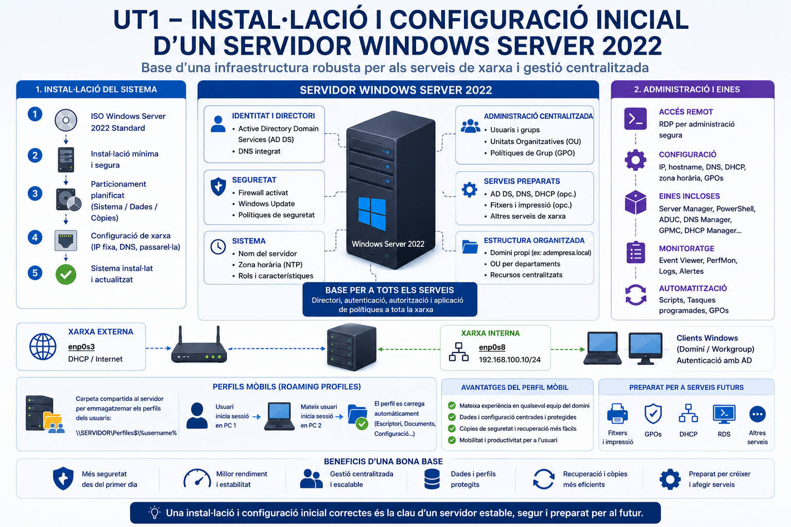

# Sistemes Operatius en Xarxa

**Manual docent · 2n CFGM Sistemes Microinformàtics i Xarxes (SMX)**  
Xavier Tartera · Institut Cirvianum

---

## Unitats de Treball

- :material-microsoft-windows:{ .lg }

    ### UT1 · Windows Server

    

    Active Directory, GPO, perfils mòbils i diagnòstic en Windows Server 2022. Inclou 7 projectes interactius.

    :material-check-circle: 52 pàgines &nbsp;·&nbsp; 10 blocs &nbsp;·&nbsp; 7 projectes

    [:octicons-arrow-right-24: Accedir a la UT1](ut1/index.md){ .md-button .md-button--primary }

- :material-linux:{ .lg }

    ### UT2 · Linux Server

    OpenLDAP, SSSD, NFS, autofs i perfils mòbils en Ubuntu Server 24.04.

    :material-check-circle: 45 pàgines &nbsp;·&nbsp; 9 blocs

    [:octicons-arrow-right-24: Accedir a la UT2](ut2/index.md){ .md-button .md-button--primary }

- :material-folder-network:{ .lg }

    ### UT3 · Compartició de recursos

    Samba, NFS, CUPS i diagnòstic en entorns mixtos Windows i Linux. Inclou 3 projectes interactius.

    :material-check-circle: 30 pàgines &nbsp;·&nbsp; 9 blocs &nbsp;·&nbsp; 3 projectes

    [:octicons-arrow-right-24: Accedir a la UT3](ut3/index.md){ .md-button .md-button--primary }

- :material-server-network:{ .lg }

    ### UT4 · Integració de sistemes heterogenis

    Active Directory, OpenLDAP i Samba-AD DC. Integració multiplataforma Windows i Linux. Inclou 4 projectes interactius.

    :material-check-circle: 30 pàgines &nbsp;·&nbsp; 7 blocs &nbsp;·&nbsp; 4 projectes

    [:octicons-arrow-right-24: Accedir a la UT4](ut4/index.md){ .md-button .md-button--primary }

---

## Com utilitzar el manual

-   :material-book-open: **Apunts**

    Teoria amb context, exemples reals i diagrames.

-   :material-hammer-wrench: **Activitats**

    Pràctiques guiades pas a pas amb rúbrica d'avaluació.

-   :material-play-circle: **Vídeos**

    Recursos audiovisuals de suport per a cada lliçó.

-   :material-help-circle: **Autoavaluació**

    Preguntes per verificar la comprensió de cada lliçó.

