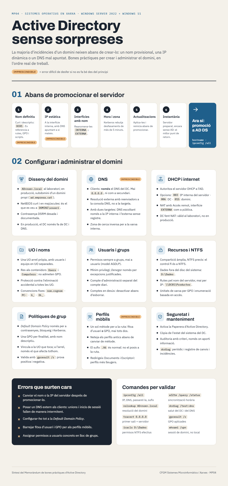

# :material-clipboard-check-outline: Bones pràctiques d'Active Directory

*Active Directory sense sorpreses: què cal tenir clar abans i després de crear el domini*

---

Ja saps què és un domini, un controlador de domini i una UO. Abans de crear el teu, atura't un moment: la majoria d'incidències d'un domini neixen **abans de crear-lo** — un nom provisional, una IP dinàmica o un DNS mal apuntat. La infografia següent recull les bones pràctiques en l'ordre real de treball.

*Fes clic a la imatge per obrir-la a mida completa.*

!!! danger "Què vol dir IMPRESCINDIBLE"
    Les targetes marcades amb **IMPRESCINDIBLE** assenyalen errors difícils de desfer si no es fan bé des del principi: el nom i la IP del servidor, el DNS dels clients i el mètode dels perfils mòbils. Si en falles un, sovint la solució més ràpida és tornar a la instantània.

---

## Com llegir la infografia

### 01 · Abans de promocionar el servidor

Són els sis passos previs a la creació del domini i s'han de completar **ara**, abans de passar a la pàgina següent. Corresponen a la [configuració inicial](../bloc2-installacio/10-configuracio-inicial.md) del servidor i als prerequisits de la [instal·lació del rol AD DS](24-installacio-ad-ds.md).

### 02 · Configurar i administrar el domini

És el mapa de tot el que treballarem a partir d'ara. No cal que ho entenguis tot avui: cada targeta es desenvolupa en un bloc de la unitat.

| Targeta | On es treballa |
|---------|----------------|
| **Disseny del domini** | [Boscos, arbres i dominis](21-boscos-arbres-dominis.md) · [Promoció a DC](25-promocio-dc.md) |
| **DNS** | [DNS integrat amb AD](26-dns-integrat-ad.md) · [Configuració DNS al client](../bloc6-clients/33-configuracio-dns-client.md) |
| **UO i noms** | [Unitats Organitzatives](23-unitats-organitzatives.md) |
| **Usuaris i grups** | [Gestió d'usuaris AD](../bloc5-usuaris-grups/27-gestio-usuaris-ad.md) · [Gestió de grups AD](../bloc5-usuaris-grups/28-gestio-grups-ad.md) |
| **Recursos i NTFS** | [Carpetes compartides](../bloc7-recursos/36-carpetes-compartides.md) · [Permisos NTFS](../bloc7-recursos/37-permisos-ntfs.md) · [Muntatge de carpetes de xarxa](../bloc7-recursos/40-muntatge-carpetes-xarxa.md) |
| **Polítiques de grup** | [GPO – conceptes](../bloc8-gpo/41-gpo-conceptes.md) · [Default Domain Policy](../bloc8-gpo/42-default-domain-policy.md) · [GPO per UO](../bloc8-gpo/43-gpo-per-uo.md) · [gpresult /r](../bloc6-clients/35-gpresult.md) |
| **Perfils mòbils** | [Configuració de perfils mòbils](../bloc9-perfils/48-configuracio-perfils-mobils.md) · [Sufix .v6](../bloc9-perfils/49-sufix-v6.md) · [Redirecció de carpetes](../bloc9-perfils/51-redireccio-carpetes-gpo.md) |
| **Seguretat i manteniment** | [Auditoria d'accés](../bloc10-monitoratge/52-auditoria-acces.md) · [PowerShell de diagnòstic](../bloc10-monitoratge/54-powershell-diagnostic.md) |
| **DHCP i internet** | Ampliació (vegeu la nota de més avall) |

---

## Notes per al nostre laboratori

!!! info "Els noms de la infografia són genèrics"
    La infografia fa servir noms d'exemple: el servidor `DC01` i el domini `AD<nom>.local`. Al manual treballem amb el servidor `SRV-WS2022` i el domini `cirvianum.local`. La bona pràctica és la mateixa; només canvia el nom.

!!! note "Continguts d'ampliació"
    Alguns punts de la infografia no es desenvolupen en cap pàgina de la UT1: la configuració del servidor **DHCP** i les seves opcions (003, 006, 015), el **NAT amb Accés remot**, el model **AGDLP**, l'**enumeració basada en accés** i la **Paperera d'Active Directory**. Pren-los com a referència professional: alguns, com el DHCP, els necessitaràs al [Projecte Integrador](../projectes-i/index.md).

!!! tip "Consell d'estudi"
    Torna a aquesta pàgina cada vegada que comencis un bloc nou i abans de donar per bona una pràctica. Els requadres **Errors que surten cars** i **Comandes per validar** del final de la infografia són una bona llista de comprovació: si una comanda no retorna el que esperes, atura't i revisa-ho abans de continuar.
