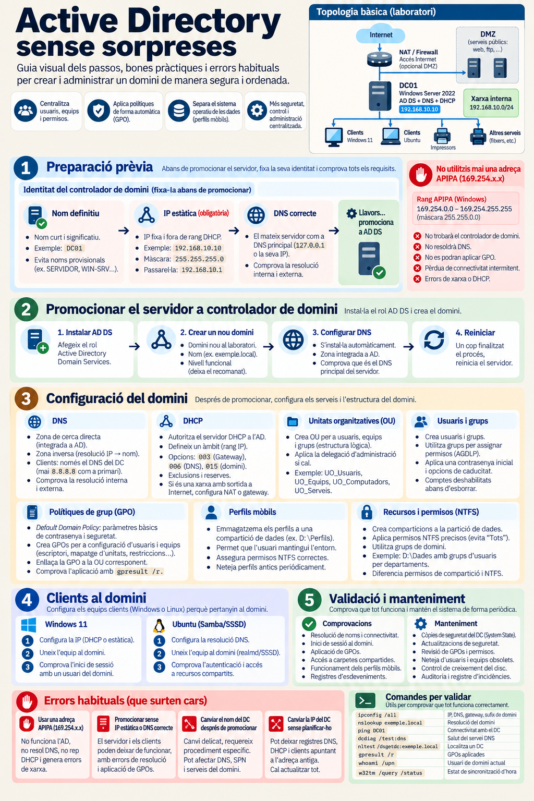

# :material-clipboard-check-outline: Bones pràctiques d'Active Directory

*Active Directory sense sorpreses: guia visual dels passos, bones pràctiques i errors habituals*

---

Ja saps què és un domini, un controlador de domini i una UO. Abans de crear el teu, atura't un moment a veure el **recorregut complet**: què cal fixar abans de promocionar el servidor, què es configura després i com es comprova que tot funciona. La infografia següent ho resumeix en cinc passos.

*Fes clic a la imatge per obrir-la a mida completa.*

Un domini serveix per a quatre coses, i totes les treballarem en aquesta unitat: **centralitzar** usuaris, equips i permisos; **aplicar polítiques** de forma automàtica (GPO); **separar** el sistema operatiu de les dades (perfils mòbils), i tenir **més seguretat** i control amb una administració única.

---

## La topologia del laboratori

A dalt a la dreta, la infografia mostra l'escenari bàsic: un únic servidor Windows Server 2022 que fa de controlador de domini i de servidor DNS (i DHCP), una xarxa interna on viuen els clients, i una sortida a Internet a través d'un NAT o tallafoc.

!!! info "Els noms de la infografia són genèrics"
    La infografia fa servir valors d'exemple; al manual treballem amb els del nostre laboratori. La bona pràctica és la mateixa, només canvien els noms.

    | | Infografia | Manual (UT1) |
    |---|-----------|--------------|
    | Servidor | `DC01` | `SRV-WS2022` |
    | Domini | `exemple.local` | `cirvianum.local` |
    | Xarxa | `192.168.10.0/24` | `10.0.2.0/24` (NAT de VirtualBox) |
    | IP del servidor | `192.168.10.10` | `10.0.2.10` |

---

## Els cinc passos

| Pas | Què es fa | On es treballa |
|-----|-----------|----------------|
| **1 · Preparació prèvia** | Fixar la identitat del servidor: nom definitiu, IP estàtica i DNS correcte | [Configuració inicial](../bloc2-installacio/10-configuracio-inicial.md) · [Instal·lació AD DS](24-installacio-ad-ds.md) |
| **2 · Promocionar el servidor** | Instal·lar el rol AD DS, crear el domini nou, deixar que es configuri el DNS i reiniciar | [Instal·lació AD DS](24-installacio-ad-ds.md) · [Promoció a DC](25-promocio-dc.md) |
| **3 · Configuració del domini** | DNS, DHCP, UO, usuaris i grups, GPO, perfils mòbils i recursos amb permisos NTFS | Blocs 4 a 9 (detall a sota) |
| **4 · Clients al domini** | Configurar la xarxa del client, unir-lo al domini i comprovar l'inici de sessió | [Unió de clients W11](../bloc6-clients/32-unio-clients-domini.md) · [Configuració DNS al client](../bloc6-clients/33-configuracio-dns-client.md) |
| **5 · Validació i manteniment** | Comprovar que tot funciona i mantenir-ho: còpies, actualitzacions, revisió i auditoria | [Validació de la integració](../bloc6-clients/34-validacio-integracio.md) · Bloc 10 |

### 1 · Preparació prèvia

És l'únic pas que has de completar **ara**, abans de passar a la pàgina següent. La identitat del controlador de domini es fixa abans de promocionar, mai després:

- **Nom definitiu**: curt i significatiu. Evita els noms provisionals (`SERVIDOR`, `WIN-K3J2H7P`...).
- **IP estàtica (obligatòria)**: fixa i fora del rang que repartirà el DHCP.
- **DNS correcte**: el servidor s'ha de tenir a si mateix com a DNS principal (`127.0.0.1` o la seva pròpia IP). Comprova la resolució interna i externa.

!!! danger "No utilitzis mai una adreça APIPA (169.254.x.x)"
    Windows s'assigna una adreça del rang `169.254.0.0/16` quan la interfície està en automàtic i **no troba cap servidor DHCP**. Si `ipconfig` et mostra una adreça `169.254.x.x`, l'equip no té una configuració de xarxa vàlida: no trobarà el controlador de domini, no resoldrà DNS i no se li aplicaran les GPO. Arregla la xarxa abans de fer res més.

### 2 · Promocionar el servidor

Quatre accions en ordre: instal·lar el rol AD DS, crear un domini nou (al laboratori, amb un nom `.local` i el nivell funcional recomanat), deixar que l'assistent instal·li el DNS integrat a AD i reiniciar. En acabar, comprova que el servidor continua sent el seu propi DNS principal.

### 3 · Configuració del domini

No cal que ho entenguis tot avui: cada targeta es desenvolupa en un bloc de la unitat.

| Targeta | Idea clau | On es treballa |
|---------|-----------|----------------|
| **DNS** | Zona directa integrada a AD i zona inversa. Els clients, només amb el DNS del DC | [DNS integrat amb AD](26-dns-integrat-ad.md) |
| **DHCP** | Autoritzar el servidor a l'AD, definir l'àmbit i les opcions 003, 006 i 015 | Ampliació (vegeu la nota de més avall) |
| **Unitats organitzatives** | UO separades per a usuaris, equips i grups; delegació només si cal | [Unitats Organitzatives](23-unitats-organitzatives.md) |
| **Usuaris i grups** | Permisos sempre a grups, mai a usuaris. Desactivar els comptes abans d'esborrar-los | [Gestió d'usuaris AD](../bloc5-usuaris-grups/27-gestio-usuaris-ad.md) · [Gestió de grups AD](../bloc5-usuaris-grups/28-gestio-grups-ad.md) |
| **Polítiques de grup** | *Default Domain Policy* només per a contrasenyes i seguretat bàsica; la resta, en GPO pròpies enllaçades a la UO | [GPO – conceptes](../bloc8-gpo/41-gpo-conceptes.md) · [Default Domain Policy](../bloc8-gpo/42-default-domain-policy.md) · [GPO per UO](../bloc8-gpo/43-gpo-per-uo.md) |
| **Perfils mòbils** | Perfils en una compartició de la partició de dades, amb els permisos NTFS correctes | [Carpeta per a perfils](../bloc9-perfils/47-carpeta-perfils-mobils.md) · [Configuració de perfils mòbils](../bloc9-perfils/48-configuracio-perfils-mobils.md) |
| **Recursos i permisos** | Comparticions a la partició de dades, permisos NTFS precisos i diferència entre permisos de compartició i NTFS | [Carpetes compartides](../bloc7-recursos/36-carpetes-compartides.md) · [Permisos NTFS](../bloc7-recursos/37-permisos-ntfs.md) |

!!! warning "El DNS dels clients és el del DC"
    El DNS **primari** d'un client del domini ha de ser sempre el controlador de domini, mai el `8.8.8.8` ni el router: un DNS públic no sap res del teu domini, i el client no trobaria el DC ni podria iniciar sessió. Els noms d'Internet els resol el mateix DC gràcies als [reenviadors](26-dns-integrat-ad.md).

### 4 · Clients al domini

Per a un client Windows 11 són tres passos: configurar la IP (per DHCP o estàtica, sempre amb el DC com a DNS), unir l'equip al domini i comprovar l'inici de sessió amb un usuari del domini.

La infografia també mostra un client **Ubuntu** unit al domini amb realmd i SSSD. Això no és matèria d'aquesta unitat: ho veurem a la UT4, a [Ubuntu → AD: realmd](../../ut4/bloc3-autenticacio-creuada/01-ubuntu-ad-realmd.md).

### 5 · Validació i manteniment

Un domini no està acabat quan «funciona», sinó quan ho has **comprovat**: resolució de noms, inici de sessió, aplicació de GPO, accés a les carpetes compartides, perfils mòbils i registres d'esdeveniments. I després cal mantenir-lo: còpies de l'estat del sistema del DC, actualitzacions de seguretat, revisió de GPO i permisos, neteja d'usuaris i equips obsolets, control de l'espai de disc i auditoria.

Ho treballarem a [Validació de la integració](../bloc6-clients/34-validacio-integracio.md), [gpresult /r](../bloc6-clients/35-gpresult.md), [Manteniment del sistema](../bloc3-administracio/16-manteniment-sistema.md), [Auditoria d'accés](../bloc10-monitoratge/52-auditoria-acces.md) i [PowerShell de diagnòstic](../bloc10-monitoratge/54-powershell-diagnostic.md).

---

## Errors habituals (que surten cars)

| Error | Què passa |
|-------|-----------|
| **Fer servir una adreça APIPA** (`169.254.x.x`) | No funciona l'AD, no es resol el DNS i no es rep configuració del DHCP |
| **Promocionar sense IP estàtica o amb el DNS mal configurat** | El servidor i els clients poden deixar de funcionar, amb errors de resolució i d'aplicació de GPO |
| **Canviar el nom del DC després de promocionar** | És un canvi delicat que requereix un procediment específic i pot afectar el DNS, els SPN i els serveis del domini |
| **Canviar la IP del DC sense planificar-ho** | Queden registres DNS, DHCP i clients apuntant a l'adreça antiga, i cal actualitzar-ho tot |

Tots quatre tenen la mateixa causa: no haver tancat bé el **pas 1**. Per això, si en detectes un al laboratori, sovint la solució més ràpida és tornar a la instantània anterior a la promoció.

---

## Comandes per validar

Les vuit comandes de la infografia, amb els noms del nostre laboratori:

| Comanda | Què comprova |
|---------|--------------|
| `ipconfig /all` | IP, DNS, porta d'enllaç i sufix de domini |
| `nslookup cirvianum.local` | Resolució del domini |
| `ping SRV-WS2022` | Connectivitat amb el DC |
| `dcdiag /test:dns` | Salut del servei DNS |
| `nltest /dsgetdc:cirvianum.local` | Localitza un DC del domini |
| `gpresult /r` | GPO aplicades |
| `whoami /upn` | Usuari de domini actual |
| `w32tm /query /status` | Estat de la sincronització d'hora |

---

!!! note "Continguts d'ampliació"
    Alguns punts de la infografia no es desenvolupen en cap pàgina de la UT1: la configuració del servidor **DHCP** (àmbit, exclusions, reserves i opcions), el **NAT** i la **DMZ** de la topologia, i el model **AGDLP** per assignar permisos. Pren-los com a referència professional: alguns, com el DHCP, els necessitaràs al [Projecte Integrador](../projectes-i/index.md).

!!! tip "Consell d'estudi"
    Torna a aquesta pàgina cada vegada que comencis un bloc nou i situa't en el pas que toca. Abans de donar per bona una pràctica, passa les **comandes per validar**: si alguna no retorna el que esperes, atura't i revisa-ho abans de continuar.
