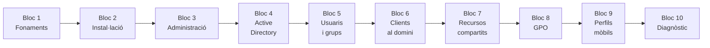

# :material-microsoft-windows: UT1 · Windows Server

!!! abstract "Presentació de la unitat"
    En aquesta unitat treballem amb **Windows Server 2022** com a plataforma de serveis de xarxa corporativa. Aprendrem a instal·lar i administrar un servidor Windows, a gestionar identitats centralitzades amb **Active Directory Domain Services (AD DS)**, a aplicar polítiques de grup (**GPO**) i a implementar **perfils mòbils** — la base conceptual que ens permetrà comparar-la, bloc a bloc, amb l'equivalent Linux a la UT2.

## Blocs de la unitat

| Bloc | Títol | Pàgines | Contingut principal |
|------|-------|:-------:|---------------------|
| **Bloc 1** | Fonaments | 01–05 | SO escriptori vs xarxa, arquitectura client-servidor, serveis Windows Server, virtualització, requisits de maquinari |
| **Bloc 2** | Instal·lació | 06–10 | Modes d'instal·lació, particionament, sistemes de fitxers NTFS/ReFS, instal·lació pas a pas, configuració inicial |
| **Bloc 3** | Administració | 11–19 | Server Manager, rols i característiques, PowerShell bàsic, monitoratge de recursos, Visor d'Esdeveniments, manteniment, planificador de tasques, unattend.xml, verificació de connectivitat |
| **Bloc 4** | Active Directory | 20–24 | Conceptes AD, unitats organitzatives (UO), instal·lació AD DS, promoció a DC, DNS integrat en AD |
| **Bloc 5** | Usuaris i grups | 25–29 | Gestió d'usuaris i grups AD, polítiques de contrasenya, restriccions horàries, PowerShell per AD |
| **Bloc 6** | Clients al domini | 30–33 | Unió de clients Windows 11, configuració DNS al client, validació de la integració, gpresult |
| **Bloc 7** | Recursos compartits | 34–38 | Carpetes compartides, permisos NTFS, herència de permisos, icacls, muntatge de carpetes de xarxa |
| **Bloc 8** | GPO | 39–43 | Conceptes GPO, Default Domain Policy, GPO per UO, GPO de restriccions, gpupdate |
| **Bloc 9** | Perfils mòbils | 44–49 | Tipus de perfils, carpeta per a perfils, configuració de perfils mòbils, sufix .V6, permisos NTFS en perfils, redirecció de carpetes |
| **Bloc 10** | Diagnòstic | 50–52 | Auditoria d'accés, diagnòstic de perfils, PowerShell de diagnòstic |

**Total: 52 pàgines**

## Mapa de la unitat

## Cap a la UT2: l'equivalent Linux

Cada concepte d'aquesta unitat té el seu paral·lel a la **UT2 · Linux Server i LDAP**. Reconèixer els equivalents accelera l'aprenentatge de les eines Linux:

| UT1 · Windows Server | UT2 · Ubuntu Server 24.04 |
|---------------------|--------------------------|
| Active Directory Domain Services (AD DS) | OpenLDAP |
| Compte d'usuari AD (`samAccountName`) | Usuari POSIX LDAP (`uid`, `uidNumber`) |
| Grup de seguretat AD | Grup POSIX (`posixGroup`, `gidNumber`) |
| Autenticació Kerberos (integrada en AD) | Autenticació via SSSD + PAM |
| Perfils mòbils `.V6` (compartit SMB) | Perfils via autofs + NFS |
| `net use` / GPO Drive Maps | autofs amb wildcard `*` |
| Permisos NTFS (`icacls`) | Permisos POSIX (`chmod` / `chown`) |
| DNS integrat en AD DS | `/etc/hosts` + `hostname` + resolució local |
| Server Manager (GUI) | `systemctl` + `apt` + `journalctl` |

---

## SpeedRun · Projectes interactius

Aplica els continguts de la UT1 amb projectes pràctics al quadern digital. Cada projecte té activitats guiades, autodesat automàtic i exportació en PDF.

- :material-rocket-launch:{ .lg }

    ## Projecte 1

    Instal·lació i configuració de Windows Server 2022 en entorn virtualitzat.

    **[:octicons-arrow-right-24: Obrir projecte 1](speedrun/projecte1.md)**

- :material-domain:{ .lg }

    ## Projecte 2

    Active Directory en Windows Server 2022: instal·lació i configuració d'AD DS.

    **[:octicons-arrow-right-24: Obrir projecte 2](speedrun/projecte2.md)**

- :material-account-group:{ .lg }

    ## Projecte 3

    Gestió avançada d'usuaris, grups i recursos compartits amb Active Directory.

    **[:octicons-arrow-right-24: Obrir projecte 3](speedrun/projecte3.md)**

- :material-shield-key:{ .lg }

    ## Projecte 4

    Roaming Profiles i GPOs: gestió avançada del domini amb Active Directory.

    **[:octicons-arrow-right-24: Obrir projecte 4](speedrun/projecte4.md)**

- :material-home-account:{ .lg }

    ## Projecte 5

    Perfils mòbils amb Active Directory: redirecció de carpetes i permisos NTFS.

    **[:octicons-arrow-right-24: Obrir projecte 5](speedrun/projecte5.md)**

- :material-trophy:{ .lg }

    ## Projecte integrador

    Implantació d'un domini corporatiu complet per a l'Institut Montseny.

    **[:octicons-arrow-right-24: Obrir projecte 6](speedrun/projecte6.md)**

- :material-help-box:{ .lg }

    ## Projecte 7

    Dossier de preguntes per blocs: consolida i avalua els coneixements de tota la UT1.

    **[:octicons-arrow-right-24: Obrir projecte 7](speedrun/projecte7.md)**

