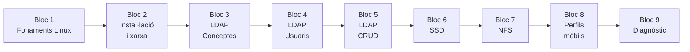

# :material-linux: UT2 · Linux Server i LDAP

!!! abstract "Presentació de la unitat"
    En aquesta unitat treballem amb **Ubuntu Server 24.04 LTS** com a plataforma de serveis de xarxa. Aprendrem a administrar un servidor Linux, a gestionar identitats amb **OpenLDAP**, a integrar l'autenticació amb **SSSD**, i a implementar **perfils mòbils** mitjançant NFS i autofs — l'equivalent Linux del que vam fer amb Active Directory i Windows Server a la UT1.

## Blocs de la unitat

| Bloc | Títol | Projecte | Contingut principal |
|------|-------|---------|---------------------|
| **Bloc 1** | Fonaments Linux | P21 | Comparativa Windows/Linux, arquitectura Ubuntu Server |
| **Bloc 2** | Instal·lació i xarxa | P21 | netplan, apt, SSH, ufw, chrony |
| **Bloc 3** | LDAP – Conceptes | P22 | Estructura LDAP, OpenLDAP, LDIF, ldapsearch |
| **Bloc 4** | LDAP – Usuaris i grups | P22–P23 | Atributs POSIX, ldapadd, ldapwhoami |
| **Bloc 5** | LDAP – Operacions CRUD | P23–P24 | ldapmodify, ldapdelete, errors freqüents |
| **Bloc 6** | SSSD | P25 | Integració LDAP-Linux, nsswitch, getent |
| **Bloc 7** | NFS | P26 | Servidor NFS, /etc/exports, exportfs |
| **Bloc 8** | Perfils mòbils | P26 | autofs, auto.master, auto.home, Ubuntu 22 vs 24 |
| **Bloc 9** | Diagnòstic | P26 | Diagnòstic integral LDAP+SSSD+NFS+autofs |

## Mapa de la unitat

## Relació amb la UT1

| UT1 (Windows Server) | UT2 (Linux / Ubuntu) |
|---------------------|---------------------|
| Active Directory DS | OpenLDAP |
| Usuaris AD (`samAccountName`) | Usuaris POSIX (`uid`, `uidNumber`) |
| Grups de seguretat AD | Grups POSIX (`posixGroup`) |
| Inici de sessió via Kerberos | Autenticació via SSSD + PAM |
| Perfils mòbils `.V6` | Perfils via autofs + NFS |
| `net use` / GPO Drive Maps | autofs amb wildcard `*` |
| `icacls` / NTFS | `chmod` / `chown` |
