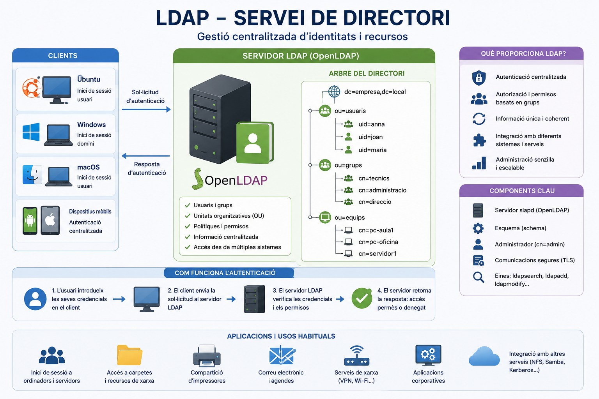

# :material-linux: UT2 · Linux Server i LDAP

!!! abstract "Presentació de la unitat"
    En aquesta unitat treballem amb **Ubuntu Server 24.04 LTS** com a plataforma de serveis de xarxa. Aprendrem a administrar un servidor Linux (usuaris locals, permisos, scripts i automatització), a gestionar identitats amb **OpenLDAP**, a integrar l'autenticació amb **SSSD**, i a implementar **perfils mòbils** mitjançant NFS i autofs — l'equivalent Linux del que vam fer amb Active Directory i Windows Server a la UT1.

## Blocs de la unitat

| Bloc | Títol | Contingut principal |
|------|-------|---------------------|
| **Bloc 1** | [Fonaments Linux](bloc1-fonaments/01-windows-vs-linux-server.md) | Comparativa Windows/Linux, arquitectura Ubuntu Server |
| **Bloc 2** | [Instal·lació i xarxa](bloc2-installacio/03-interficies-xarxa-linux.md) | netplan, apt, SSH, ufw, chrony |
| **Bloc 3** | [Administració bàsica de Linux](bloc3-adminbasica-linux/10-gestio-arxius-permisos.md) | Permisos, usuaris/grups locals, bash, cron, administració web |
| **Bloc 4** | [LDAP – Conceptes](bloc4-ldap-conceptes/15-conceptes-ldap.md) | Estructura LDAP, OpenLDAP, LDIF, ldapsearch |
| **Bloc 5** | [LDAP – Usuaris i grups](bloc5-ldap-usuaris/21-atributs-posix.md) | Atributs POSIX, ldapadd, ldapwhoami, gestió gràfica |
| **Bloc 6** | [LDAP – Operacions CRUD](bloc6-ldap-crud/29-ldapmodify.md) | ldapmodify, ldapdelete, errors freqüents |
| **Bloc 7** | [SSSD](bloc7-sssd/33-sssd-conceptes.md) | Integració LDAP-Linux, nsswitch, getent |
| **Bloc 8** | [NFS](bloc8-nfs/40-nfs-conceptes.md) | Servidor NFS, /etc/exports, exportfs |
| **Bloc 9** | [Perfils mòbils](bloc9-perfils-mobils/44-estructura-perfils-linux.md) | autofs, auto.master, auto.home, Ubuntu 22 vs 24 |
| **Bloc 10** | [Diagnòstic](bloc10-diagnostic/51-diagnostic-integral-linux.md) | Diagnòstic integral LDAP+SSSD+NFS+autofs |

## Mapa de la unitat

```mermaid
graph LR
    B1["Bloc 1\nFonaments Linux"] --> B2["Bloc 2\nInstal·lació\ni xarxa"]
    B2 --> B3["Bloc 3\nAdministració\nbàsica"]
    B3 --> B4["Bloc 4\nLDAP\nConceptes"]
    B4 --> B5["Bloc 5\nLDAP\nUsuaris"]
    B5 --> B6["Bloc 6\nLDAP\nCRUD"]
    B6 --> B7["Bloc 7\nSSSD"]
    B7 --> B8["Bloc 8\nNFS"]
    B8 --> B9["Bloc 9\nPerfils\nmòbils"]
    B9 --> B10["Bloc 10\nDiagnòstic"]
    click B1 "bloc1-fonaments/01-windows-vs-linux-server/" "Obrir Bloc 1"
    click B2 "bloc2-installacio/03-interficies-xarxa-linux/" "Obrir Bloc 2"
    click B3 "bloc3-adminbasica-linux/10-gestio-arxius-permisos/" "Obrir Bloc 3"
    click B4 "bloc4-ldap-conceptes/15-conceptes-ldap/" "Obrir Bloc 4"
    click B5 "bloc5-ldap-usuaris/21-atributs-posix/" "Obrir Bloc 5"
    click B6 "bloc6-ldap-crud/29-ldapmodify/" "Obrir Bloc 6"
    click B7 "bloc7-sssd/33-sssd-conceptes/" "Obrir Bloc 7"
    click B8 "bloc8-nfs/40-nfs-conceptes/" "Obrir Bloc 8"
    click B9 "bloc9-perfils-mobils/44-estructura-perfils-linux/" "Obrir Bloc 9"
    click B10 "bloc10-diagnostic/51-diagnostic-integral-linux/" "Obrir Bloc 10"
```

---

## SpeedRun · Projectes interactius

Aplica els continguts de la UT2 amb projectes pràctics al quadern digital. Cada projecte té activitats guiades, autodesat automàtic i exportació en PDF.

- :material-ubuntu:{ .lg }

    ### Projecte 21 · Instal·lació Ubuntu

    Desplega Ubuntu Server 24.04 LTS en entorn virtualitzat des de zero.

    :material-clock-outline: 4 h &nbsp;·&nbsp; Blocs 1–3 &nbsp;·&nbsp; RA1

    [:octicons-arrow-right-24: Veure el projecte](speedrun/projecte21.md){ .md-button .md-button--primary }

- :material-file-tree:{ .lg }

    ### Projecte 22 · LDAP amb LDIF

    Instal·la OpenLDAP i crea usuaris i grups POSIX amb fitxers LDIF.

    :material-clock-outline: 4 h &nbsp;·&nbsp; Blocs 4–5 &nbsp;·&nbsp; RA2, RA3

    [:octicons-arrow-right-24: Veure el projecte](speedrun/projecte22.md){ .md-button .md-button--primary }

- :material-account-multiple:{ .lg }

    ### Projecte 23 · LDAP multiusuari

    Amplia el directori amb múltiples usuaris i grups garantint la coherència UID/GID.

    :material-clock-outline: 4 h &nbsp;·&nbsp; Blocs 5–6 &nbsp;·&nbsp; RA3

    [:octicons-arrow-right-24: Veure el projecte](speedrun/projecte23.md){ .md-button .md-button--primary }

- :material-database-edit:{ .lg }

    ### Projecte 24 · LDAP CRUD

    Practica totes les operacions CRUD i diagnostica errors freqüents del directori.

    :material-clock-outline: 4 h &nbsp;·&nbsp; Bloc 6 &nbsp;·&nbsp; RA3, RA4

    [:octicons-arrow-right-24: Veure el projecte](speedrun/projecte24.md){ .md-button .md-button--primary }

- :material-shield-account:{ .lg }

    ### Projecte 25 · SSSD

    Integra LDAP amb el sistema Linux via SSSD i valida l'autenticació real.

    :material-clock-outline: 4 h &nbsp;·&nbsp; Bloc 7 &nbsp;·&nbsp; RA4, RA5

    [:octicons-arrow-right-24: Veure el projecte](speedrun/projecte25.md){ .md-button .md-button--primary }

- :material-home-account:{ .lg }

    ### Projecte 26 · Perfils mòbils

    Implementa perfils mòbils complets amb NFS, autofs i SSSD.

    :material-clock-outline: 4 h &nbsp;·&nbsp; Blocs 8–10 &nbsp;·&nbsp; RA4, RA5

    [:octicons-arrow-right-24: Veure el projecte](speedrun/projecte26.md){ .md-button .md-button--primary }

- :material-help-box:{ .lg }

    ### Projecte 27 · Dossier de preguntes OPCIONAL

    Consolida i avalua els coneixements teòrics de tota la unitat per blocs.

    :material-clock-outline: 3–5 h &nbsp;·&nbsp; UT2 completa &nbsp;·&nbsp; RA1–RA5

    [:octicons-arrow-right-24: Veure el projecte](speedrun/projecte27.md){ .md-button .md-button--primary }

---

## Relació amb la UT1

| UT1 (Windows Server) | UT2 (Linux / Ubuntu) |
|---------------------|---------------------|
| Gestió d'usuaris a AD (GUI) | Usuaris locals (`adduser`) i LDAP |
| PowerShell | Scripts de bash |
| Planificador de tasques | cron / crontab |
| `icacls` / NTFS | `chmod` / `chown` |
| Active Directory DS | OpenLDAP |
| Usuaris AD (`samAccountName`) | Usuaris POSIX (`uid`, `uidNumber`) |
| Grups de seguretat AD | Grups POSIX (`posixGroup`) |
| Inici de sessió via Kerberos | Autenticació via SSSD + PAM |
| Perfils mòbils `.V6` | Perfils via autofs + NFS |
