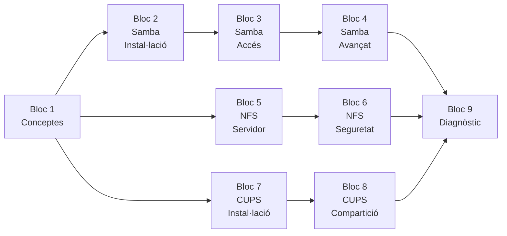

# :material-folder-network: UT3 · Compartició de recursos

!!! abstract "Presentació de la unitat"
    En aquesta unitat treballem amb les tres principals tecnologies de **compartició de recursos** en entorns Linux: **Samba** (protocol SMB per a Windows i Linux), **NFS** (Network File System natiu Linux) i **CUPS** (Common UNIX Printing System per a impressió en xarxa). Apliquem criteris de seguretat, gestionem usuaris i permisos, i integrem amb l'OpenLDAP de la UT2.

## Blocs de la unitat

| Bloc | Títol | Projecte | Contingut principal |
|------|-------|---------|---------------------|
| **Bloc 1** | [Conceptes de compartició](bloc1-conceptes/01-conceptes-comparticio-recursos.md) | P31–P33 | Protocols SMB, NFS, IPP; comparativa de tecnologies |
| **Bloc 2** | [Samba: instal·lació](bloc2-samba-installacio/03-samba-arquitectura-installacio.md) | P31 | `apt install samba`, `smb.conf`, accés lliure |
| **Bloc 3** | [Samba: control d'accés](bloc3-samba-acces/06-samba-acces-restringit.md) | P31 | `valid users`, grups Linux, `smbpasswd` |
| **Bloc 4** | [Samba: gestió avançada](bloc4-samba-avanzat/09-samba-permisos-mascara.md) | P31 | Permisos compostos, quotes, integració LDAP |
| **Bloc 5** | [NFS: servidor](bloc5-nfs-servidor/12-nfs-arquitectura-conceptes.md) | P32 | `nfs-kernel-server`, `/etc/exports`, `exportfs` |
| **Bloc 6** | [NFS: client i seguretat](bloc6-nfs-client-seguretat/16-nfs-client-muntatge-manual.md) | P32 | Muntatge, `/etc/fstab`, UFW, `noexec`, `all_squash` |
| **Bloc 7** | [CUPS: instal·lació](bloc7-cups-installacio/22-cups-arquitectura-installacio.md) | P33 | `apt install cups`, port 631, impressora PDF |
| **Bloc 8** | [CUPS: compartició](bloc8-cups-comparticio/26-cups-comparticio-xarxa.md) | P33 | Impressió en xarxa, `AllowGroup`, Samba+Windows |
| **Bloc 9** | [Diagnòstic](bloc9-diagnostic/30-diagnostic-integral-ut3.md) | P31–P33 | Diagnòstic integral Samba + NFS + CUPS |

## Mapa de la unitat

---

## SpeedRun · Projectes interactius

Aplica els continguts de la UT3 amb projectes pràctics al quadern digital. Cada projecte té activitats guiades, autodesat automàtic i exportació en PDF.

- :material-folder-network:{ .lg }

    ### Projecte 31 · Compartició amb Samba

    Configura un servidor Samba amb accés lliure, restringit i per grups en entorn Linux.

    :material-clock-outline: 8–10 h &nbsp;·&nbsp; Blocs 1–4 &nbsp;·&nbsp; RA4, RA5, RA6

    [:octicons-arrow-right-24: Veure el projecte](speedrun/projecte31.md){ .md-button .md-button--primary }

- :material-server-network:{ .lg }

    ### Projecte 32 · Compartició amb NFS

    Desplega un servidor NFS, controla l'accés per IP i gestiona la seguretat de muntatge.

    :material-clock-outline: 8–10 h &nbsp;·&nbsp; Blocs 5–6 &nbsp;·&nbsp; RA3, RA4, RA5

    [:octicons-arrow-right-24: Veure el projecte](speedrun/projecte32.md){ .md-button .md-button--primary }

- :material-printer:{ .lg }

    ### Projecte 33 · Gestió d'impressió CUPS

    Instal·la CUPS, configura impressores virtuals i comparteix en xarxa amb control de grups.

    :material-clock-outline: 6–8 h &nbsp;·&nbsp; Blocs 7–8 &nbsp;·&nbsp; RA4, RA5, RA6

    [:octicons-arrow-right-24: Veure el projecte](speedrun/projecte33.md){ .md-button .md-button--primary }

- :material-help-box:{ .lg }

    ### Projecte 34 · Dossier de preguntes

    Consolida i avalua els coneixements teòrics de tota la unitat per blocs.

    :material-clock-outline: 3–5 h &nbsp;·&nbsp; UT3 completa &nbsp;·&nbsp; RA3–RA6

    [:octicons-arrow-right-24: Veure el projecte](speedrun/projecte34.md){ .md-button .md-button--primary }

---

## Relació amb la UT1 i UT2

| UT1 (Windows Server) | UT2 (Linux Server) | UT3 (Compartició) |
|---------------------|-------------------|--------------------|
| Carpetes compartides SMB | NFS bàsic (Bloc 7) | Samba avançat + NFS avançat |
| `net use` / GPO Drive Maps | autofs + NFS | `/etc/fstab` + muntatge automàtic |
| `icacls` / permisos NTFS | `chmod` / `chown` | `valid users`, `AllowGroup`, `anonuid` |
| Impressió via Windows Print | — | CUPS + integració Samba-Windows |
| AD + Kerberos | LDAP + SSSD | `passdb backend = ldapsam` |
