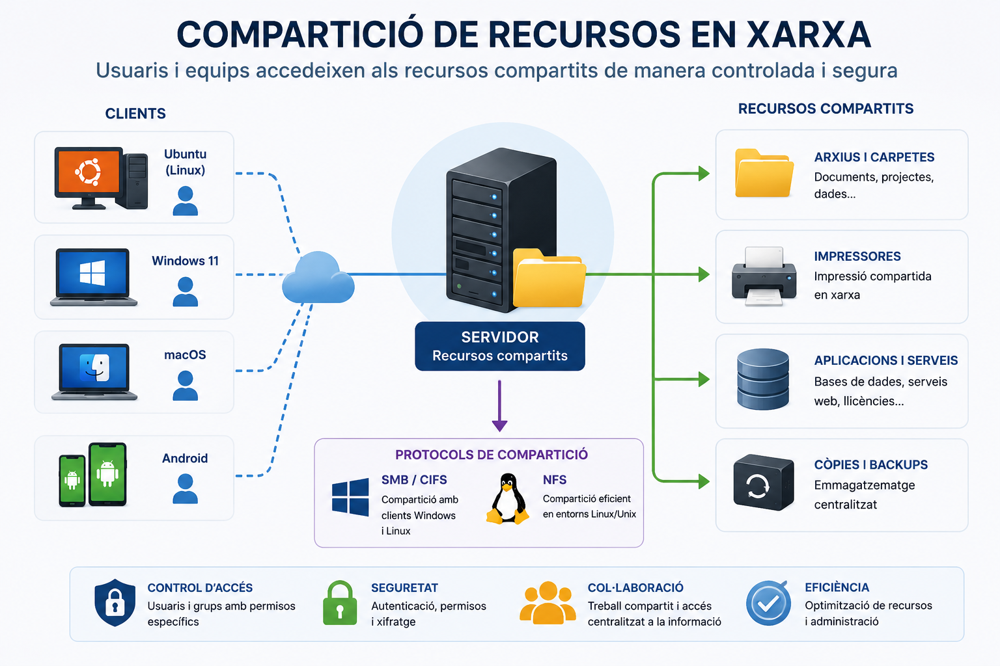
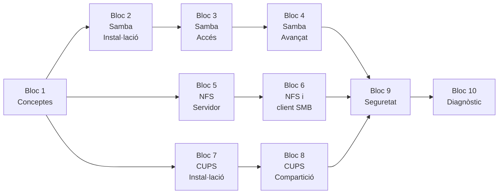

# :material-folder-network: UT3 · Compartició de recursos

!!! abstract "Presentació de la unitat"
    En aquesta unitat treballem amb les tres principals tecnologies de **compartició de recursos** en entorns Linux: **Samba** (protocol SMB per a Windows i Linux), **NFS** (Network File System natiu Linux) i **CUPS** (Common UNIX Printing System per a impressió en xarxa). Apliquem criteris de **seguretat**, gestionem usuaris i permisos, aprenem a accedir a comparticions SMB des de Linux, i integrem amb l'OpenLDAP de la UT2.

## Blocs de la unitat

| Bloc | Títol | Contingut principal |
|------|-------|---------------------|
| **Bloc 1** | [Conceptes de compartició](bloc1-conceptes/01-conceptes-comparticio-recursos.md) | Protocols SMB, NFS, IPP; comparativa de tecnologies |
| **Bloc 2** | [Samba: instal·lació](bloc2-samba-installacio/03-samba-arquitectura-installacio.md) | `apt install samba`, `smb.conf`, accés lliure |
| **Bloc 3** | [Samba: control d'accés](bloc3-samba-acces/06-samba-acces-restringit.md) | `valid users`, grups Linux, `smbpasswd` |
| **Bloc 4** | [Samba: gestió avançada](bloc4-samba-avanzat/09-samba-permisos-mascara.md) | Permisos compostos, quotes, integració LDAP |
| **Bloc 5** | [NFS: servidor](bloc5-nfs-servidor/12-nfs-arquitectura-conceptes.md) | `nfs-kernel-server`, `/etc/exports`, `exportfs` |
| **Bloc 6** | [NFS i client SMB](bloc6-nfs-client-seguretat/16-nfs-client-muntatge-manual.md) | Muntatge NFS, `/etc/fstab`, UFW, i **client SMB des de Linux** (`smbclient`, `mount -t cifs`) |
| **Bloc 7** | [CUPS: instal·lació](bloc7-cups-installacio/23-cups-arquitectura-installacio.md) | `apt install cups`, port 631, impressora PDF |
| **Bloc 8** | [CUPS: compartició](bloc8-cups-comparticio/27-cups-comparticio-xarxa.md) | Impressió en xarxa, `AllowGroup`, Samba+Windows |
| **Bloc 9** | [Seguretat en la compartició](bloc9-seguretat-comparticio/31-minim-privilegi-bones-practiques.md) | Mínim privilegi, xifratge SMB, auditoria, checklist d'enduriment |
| **Bloc 10** | [Diagnòstic](bloc10-diagnostic/35-diagnostic-integral-ut3.md) | Diagnòstic integral Samba + NFS + CUPS |

## Mapa de la unitat

```mermaid
graph LR
    B1["Bloc 1\nConceptes"] --> B2["Bloc 2\nSamba\nInstal·lació"]
    B2 --> B3["Bloc 3\nSamba\nAccés"]
    B3 --> B4["Bloc 4\nSamba\nAvançat"]
    B1 --> B5["Bloc 5\nNFS\nServidor"]
    B5 --> B6["Bloc 6\nNFS i\nclient SMB"]
    B1 --> B7["Bloc 7\nCUPS\nInstal·lació"]
    B7 --> B8["Bloc 8\nCUPS\nCompartició"]
    B4 --> B9["Bloc 9\nSeguretat"]
    B6 --> B9
    B8 --> B9
    B9 --> B10["Bloc 10\nDiagnòstic"]
    click B1 "bloc1-conceptes/01-conceptes-comparticio-recursos/" "Obrir Bloc 1"
    click B2 "bloc2-samba-installacio/03-samba-arquitectura-installacio/" "Obrir Bloc 2"
    click B3 "bloc3-samba-acces/06-samba-acces-restringit/" "Obrir Bloc 3"
    click B4 "bloc4-samba-avanzat/09-samba-permisos-mascara/" "Obrir Bloc 4"
    click B5 "bloc5-nfs-servidor/12-nfs-arquitectura-conceptes/" "Obrir Bloc 5"
    click B6 "bloc6-nfs-client-seguretat/16-nfs-client-muntatge-manual/" "Obrir Bloc 6"
    click B7 "bloc7-cups-installacio/23-cups-arquitectura-installacio/" "Obrir Bloc 7"
    click B8 "bloc8-cups-comparticio/27-cups-comparticio-xarxa/" "Obrir Bloc 8"
    click B9 "bloc9-seguretat-comparticio/31-minim-privilegi-bones-practiques/" "Obrir Bloc 9"
    click B10 "bloc10-diagnostic/35-diagnostic-integral-ut3/" "Obrir Bloc 10"
```

---

## SpeedRun · Projectes interactius

Aplica els continguts de la UT3 amb projectes pràctics al quadern digital. Cada projecte té activitats guiades, autodesat automàtic i exportació en PDF.

- :material-folder-network:{ .lg }

    ### Projecte 31 · Compartició amb Samba

    Configura un servidor Samba amb accés lliure, restringit i per grups en entorn Linux.

    :material-clock-outline: 4 h &nbsp;·&nbsp; Blocs 1–4 &nbsp;·&nbsp; RA4, RA5, RA6

    [:octicons-arrow-right-24: Veure el projecte](speedrun/projecte31.md){ .md-button .md-button--primary }

- :material-server-network:{ .lg }

    ### Projecte 32 · Compartició amb NFS

    Desplega un servidor NFS, controla l'accés per IP i gestiona la seguretat de muntatge.

    :material-clock-outline: 4 h &nbsp;·&nbsp; Blocs 5–6 &nbsp;·&nbsp; RA3, RA4, RA5

    [:octicons-arrow-right-24: Veure el projecte](speedrun/projecte32.md){ .md-button .md-button--primary }

- :material-printer:{ .lg }

    ### Projecte 33 · Gestió d'impressió CUPS

    Instal·la CUPS, configura impressores virtuals i comparteix en xarxa amb control de grups.

    :material-clock-outline: 4 h &nbsp;·&nbsp; Blocs 7–8 &nbsp;·&nbsp; RA4, RA5, RA6

    [:octicons-arrow-right-24: Veure el projecte](speedrun/projecte33.md){ .md-button .md-button--primary }

- :material-help-box:{ .lg }

    ### Projecte 34 · Dossier de preguntes OPCIONAL

    Activitat opcional. Consolida i avalua els coneixements teòrics de tota la unitat per blocs.

    :material-clock-outline: 3–5 h &nbsp;·&nbsp; UT3 completa &nbsp;·&nbsp; RA3–RA6

    [:octicons-arrow-right-24: Veure el projecte](speedrun/projecte34.md){ .md-button .md-button--primary }

---

## Relació amb la UT1 i UT2

| UT1 (Windows Server) | UT2 (Linux Server) | UT3 (Compartició) |
|---------------------|-------------------|--------------------|
| Carpetes compartides SMB | NFS bàsic | Samba avançat + NFS avançat |
| Client SMB de Windows | — | Client SMB des de Linux (`mount -t cifs`) |
| `net use` / GPO Drive Maps | autofs + NFS | `/etc/fstab` + muntatge automàtic |
| `icacls` / permisos NTFS | `chmod` / `chown` | `valid users`, `AllowGroup`, `anonuid` |
| Auditoria (Visor d'Esdeveniments) | — | Auditoria Samba (`full_audit`) |
| AD + Kerberos | LDAP + SSSD | `passdb backend = ldapsam` |
