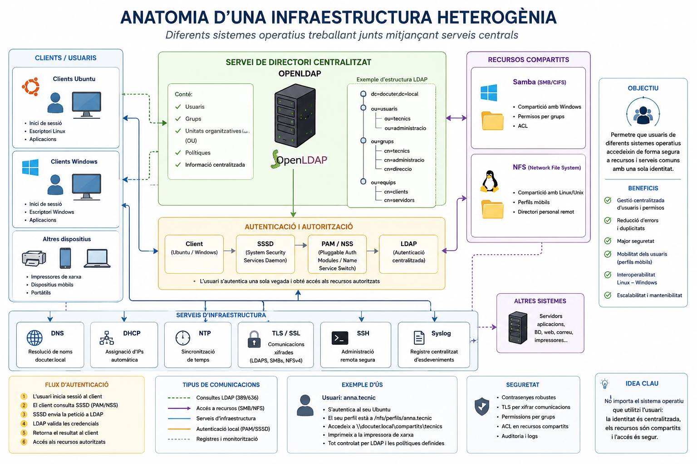

# Anatomia d'una infraestructura heterogènia

*Diferents sistemes operatius treballant junts mitjançant serveis centrals*

---

Abans de posar-nos a configurar res, cal entendre el **quadre complet**: com encaixen totes les peces d'una infraestructura real on conviuen Linux, Windows i altres dispositius. La imatge següent en mostra l'anatomia.



L'**objectiu** de tot plegat és simple: que un usuari pugui seure davant de qualsevol equip —Ubuntu o Windows— i accedir als seus recursos amb una sola identitat, sense que importi quin sistema operatiu hi ha al darrere.

---

## Les sis capes de la infraestructura

### 1 · El servei de directori centralitzat

Al centre de tot hi ha **OpenLDAP** (o Active Directory, o Samba AD DC — depèn de l'entorn). És la base de dades única que conté:

- **Usuaris** — qui ets
- **Grups** — a quins departaments pertanys
- **Unitats Organitzatives (OU)** — l'estructura jeràrquica de l'organització
- **Polítiques** — quines restriccions s'apliquen a cada grup
- **Informació centralitzada** — correu, telèfon, directori personal...

L'estructura interna del directori (el DIT, *Directory Information Tree*) segueix una jerarquia com aquesta:

```
dc=docuter,dc=local
├── ou=usuaris
│   ├── ou=tecnics
│   └── ou=administracio
├── ou=grups
│   ├── cn=tecnics
│   ├── cn=administracio
│   └── cn=direccio
└── ou=equips
    ├── cn=clients
    └── cn=servidors
```

Cada objecte d'aquesta estructura té atributs: el nom d'usuari, el UID, el GID, la contrasenya (en hash), el directori personal, el shell... Tot en un sol lloc.

!!! tip "La idea clau"
    No importa el sistema operatiu que utilitzi l'usuari: **la identitat és centralitzada, els recursos són compartits i l'accés és segur**.

---

### 2 · Els clients i els usuaris

Tres tipus de clients es connecten a la infraestructura:

| Client | Característiques |
|--------|-----------------|
| **Ubuntu** | Inici de sessió Linux, escriptori GNOME, aplicacions Linux |
| **Windows** | Inici de sessió Windows, escriptori Windows, aplicacions Win32 |
| **Altres dispositius** | Impressores de xarxa, dispositius mòbils, portàtils |

La gràcia és que **l'usuari `anna.tecnic` és el mateix** en tots tres casos. Quan inicia sessió a l'Ubuntu, obté el seu perfil. Quan s'asseu davant d'un Windows, obté el seu perfil Windows. Les seves dades i permisos viatgen amb ell.

---

### 3 · El flux d'autenticació (els 6 passos)

Quan un usuari escriu el seu nom i contrasenya, el que passa per sota és aquest flux:

```
① L'usuari inicia sessió al client
          ↓
② El client consulta SSSD (PAM/NSS)
          ↓
③ SSSD envia la petició a LDAP
          ↓
④ LDAP valida les credencials
          ↓
⑤ Retorna el resultat al client
          ↓
⑥ Accés als recursos autoritzats
```

**Client (Ubuntu / Windows)** — El punt d'entrada. Recull el nom d'usuari i la contrasenya.

**SSSD** *(System Security Services Daemon)* — El pont entre el client i el directori remot. Gestiona les peticions d'autenticació i fa caché de credencials per si el servidor no és accessible.

**PAM / NSS** *(Pluggable Authentication Modules / Name Service Switch)* — La capa del sistema operatiu que decideix *com* s'autentica un usuari i *on* es busca la informació d'usuaris i grups.

**LDAP** *(Autenticació centralitzada)* — El directori que valida les credencials i retorna els atributs de l'usuari: uid, gid, directori personal, shell, grups...

!!! info "Per a què serveix la caché de SSSD?"
    Si el servidor LDAP no és accessible, SSSD pot autenticar l'usuari amb les credencials que té en memòria cau durant un temps configurable. Especialment útil en portàtils que no sempre estan connectats a la xarxa corporativa.

---

### 4 · Els recursos compartits

Un cop autenticat, l'usuari pot accedir als recursos de la xarxa:

**Samba (SMB/CIFS)** — Protocol natiu de Windows per compartir carpetes i impressores. Samba l'implementa a Linux:
- Els clients Windows hi accedeixen de manera nativa (sense instal·lar res)
- Suporta permisos per grups i ACLs per a control d'accés granular

**NFS** *(Network File System)* — Protocol Unix/Linux per compartir sistemes de fitxers en xarxa:
- Compartició de carpetes entre sistemes Linux/Unix
- **Perfils mòbils**: el directori personal s'emmagatzema al servidor i es munta automàticament en qualsevol equip de la xarxa

---

### 5 · Els serveis d'infraestructura

Per sota de tot, sis serveis fan possible que la infraestructura funcioni:

| Servei | Funció |
|--------|--------|
| **DNS** | Resolució de noms (`docuter.local → 192.168.x.x`). Sense DNS, ni LDAP ni Kerberos funcionen |
| **DHCP** | Assignació automàtica d'IPs als clients de la xarxa |
| **NTP** | Sincronització horària. Crítica per a Kerberos (±5 minuts de tolerància) |
| **TLS/SSL** | Xifrat de les comunicacions (LDAPS, SMBs, NFSv4) |
| **SSH** | Administració remota segura dels servidors |
| **Syslog** | Registre centralitzat d'esdeveniments de tots els sistemes |

!!! warning "NTP: el servei més ignorat i el més crític"
    Kerberos rebutja qualsevol tiquet on la diferència d'hora entre el client i el servidor superi els **5 minuts**. Un servidor NTP mal configurat pot fer que tota l'autenticació del domini deixi de funcionar de manera aparentment inexplicable.

---

### 6 · Seguretat

- **Contrasenyes robustes** — polítiques de complexitat i caducitat definides al directori
- **TLS** per xifrar totes les comunicacions (LDAPS en lloc de LDAP, SMBs, NFSv4 amb Kerberos)
- **Permisos per grups** — l'accés als recursos es defineix per grup, no per usuari individual
- **ACL en recursos compartits** — control granular sobre qui pot llegir, escriure o executar
- **Auditoria i logs** — tots els accessos queden registrats al Syslog centralitzat

---

## Els tipus de comunicacions

| Tipus | Protocol | Exemple |
|-------|----------|---------|
| Consultes LDAP | TCP 389 / LDAPS 636 | SSSD consultant usuaris al directori |
| Accés a recursos | SMB/CIFS, NFS | Muntar una carpeta compartida |
| Serveis d'infraestructura | DNS, DHCP, NTP, SSH | Resolució de noms, sincronització |
| Autenticació local | PAM/SSSD | Validació de credencials al client |
| Registres i monitoratge | Syslog | Enviament de logs al servidor central |

---

## Beneficis d'una infraestructura heterogènia ben integrada

| Benefici | Descripció |
|----------|-----------|
| **Gestió centralitzada** | Usuaris i permisos en un sol lloc. Un canvi es propaga a tots els sistemes |
| **Reducció d'errors** | Sense duplicitats d'usuaris ni contrasenyes desincronitzades |
| **Major seguretat** | Polítiques uniformes, auditoria centralitzada |
| **Mobilitat dels usuaris** | Perfils mòbils: l'usuari troba el seu entorn en qualsevol equip |
| **Interoperabilitat** | Linux i Windows comparteixen recursos sense friccions |
| **Escalabilitat** | Afegir nous equips o usuaris sense reconfigurar cada màquina |

---

## On som a la UT4?

Aquesta pàgina ha presentat el **model conceptual complet**. A les pàgines següents construirem cada peça:

- **Bloc 2** — NFS multiplataforma (WS2022 → Ubuntu 24.04)
- **Bloc 3** — Ubuntu al domini Active Directory (realmd + SSSD)
- **Bloc 4** — Samba com a AD DC (Ubuntu com a servidor de domini)
- **Bloc 5** — Recursos compartits i ACLs en entorns heterogenis
- **Bloc 6** — Diagnòstic integral

!!! tip "Consell d'estudi"
    Guarda la infografia i torna-hi cada vegada que comencis un bloc nou. Cada pràctica que fas encaixa en alguna de les capes que acabes de llegir. Quan acabis la UT4, hauries de ser capaç d'explicar cada fletxa i cada caixa de la imatge amb les teves pròpies paraules.
