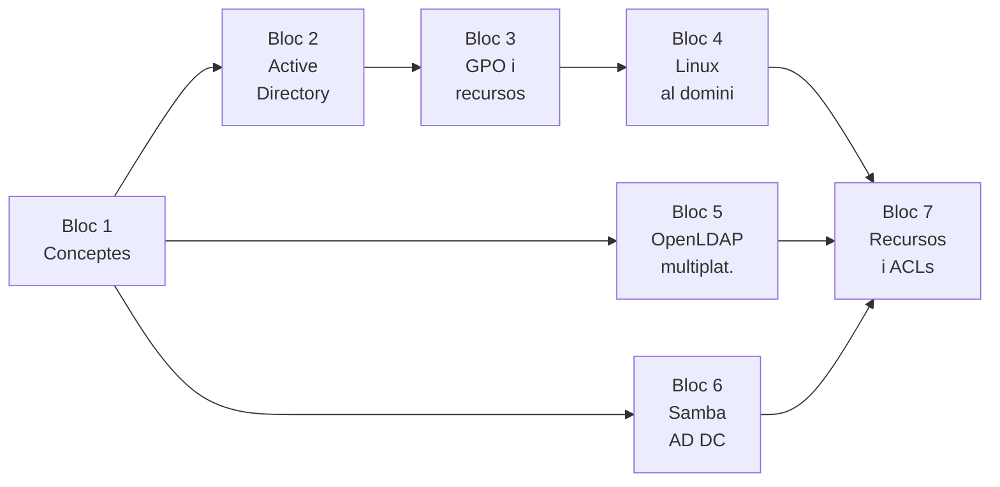

# :material-lan-connect: UT4 · Integració de sistemes heterogenis

!!! abstract "Presentació de la unitat"
    En aquesta unitat integrem entorns **Windows i Linux** en un únic directori d'usuaris. Treballem les tres grans solucions de directori: **Active Directory** (Windows Server 2022), **OpenLDAP multiplataforma** (Ubuntu amb clients Windows via pGina) i **Samba com a controlador de domini AD-compatible**. Apliquem polítiques de grup (GPO), perfils mòbils, ACLs esteses i integració creuada de clients.

## Blocs de la unitat

| Bloc | Títol | Projecte | Contingut principal |
|------|-------|---------|---------------------|
| **Bloc 1** | [Conceptes d'integració](bloc1-conceptes/01-sistemes-heterogenis-conceptes.md) | P41–P43 | Sistemes heterogenis, protocols (LDAP, Kerberos, SMB, NFS), comparativa |
| **Bloc 2** | [Active Directory](bloc2-active-directory/03-active-directory-arquitectura.md) | P41 | Forest, DC, DNS integrat, OUs, usuaris i grups |
| **Bloc 3** | [GPO i recursos Windows](bloc3-gpo-recursos-windows/08-gpo-group-policy-management.md) | P41 | Group Policy, restriccions, perfils mòbils Windows, backups |
| **Bloc 4** | [Linux al domini AD](bloc4-linux-ad/12-windows11-unio-domini.md) | P41 | Windows 11 al domini, Ubuntu+realmd+sssd, Kerberos, mkhomedir |
| **Bloc 5** | [OpenLDAP multiplataforma](bloc5-openldap-multiplataforma/17-openldap-dit-ous.md) | P42 | PAM+NSS, pGina, perfils NFS+LDAP, validació creuada |
| **Bloc 6** | [Samba com a AD DC](bloc6-samba-ad-dc/22-samba-ad-dc-arquitectura.md) | P43 | `samba-tool domain provision`, clients Windows i Linux al Samba-AD |
| **Bloc 7** | [Recursos i ACLs](bloc7-recursos-acls/27-recursos-compartits-domini.md) | P43 | Recursos compartits al domini, `setfacl`/`getfacl`, `acl_xattr`, diagnòstic |

## Mapa de la unitat

---

## SpeedRun · Projectes interactius

Aplica els continguts de la UT4 amb projectes pràctics al quadern digital. Cada projecte té activitats guiades, autodesat automàtic i exportació en PDF.

- :material-microsoft-windows:{ .lg }

    ### Projecte 41 · Windows Active Directory

    Desplega un DC amb Windows Server 2022, gestiona OUs, GPOs, clients W11 i Ubuntu al domini AD.

    :material-clock-outline: 10–12 h &nbsp;·&nbsp; Blocs 1–4 &nbsp;·&nbsp; RA2, RA3, RA4, RA5, RA6

    [:octicons-arrow-right-24: Veure el projecte](speedrun/projecte41.md){ .md-button .md-button--primary }

- :material-server-network:{ .lg }

    ### Projecte 42 · OpenLDAP multiplataforma

    Configura OpenLDAP amb clients Ubuntu (PAM/NSS), Windows (pGina) i perfils mòbils NFS.

    :material-clock-outline: 10–12 h &nbsp;·&nbsp; Blocs 1, 5 &nbsp;·&nbsp; RA2, RA3, RA4, RA5, RA6

    [:octicons-arrow-right-24: Veure el projecte](speedrun/projecte42.md){ .md-button .md-button--primary }

- :material-domain:{ .lg }

    ### Projecte 43 · Samba com a AD DC

    Desplega Samba-AD DC (libretic.local), uneix clients Windows i Ubuntu, comparteix recursos amb ACLs.

    :material-clock-outline: 10–12 h &nbsp;·&nbsp; Blocs 1, 6–7 &nbsp;·&nbsp; RA1, RA2, RA3, RA4, RA5, RA6

    [:octicons-arrow-right-24: Veure el projecte](speedrun/projecte43.md){ .md-button .md-button--primary }

- :material-help-box:{ .lg }

    ### Projecte 44 · Dossier de preguntes

    Consolida i avalua els coneixements teòrics de tota la unitat per blocs.

    :material-clock-outline: 3–5 h &nbsp;·&nbsp; UT4 completa &nbsp;·&nbsp; RA2–RA6

    [:octicons-arrow-right-24: Veure el projecte](speedrun/projecte44.md){ .md-button .md-button--primary }

---

## Relació amb UT1, UT2 i UT3

| UT1 (Windows Server) | UT2 (Linux Server) | UT3 (Compartició) | UT4 (Integració) |
|---------------------|-------------------|--------------------|-----------------|
| AD DS bàsic | OpenLDAP bàsic | Samba + LDAP | AD avançat + Samba-AD DC |
| GPO bàsiques | SSSD per LDAP | — | SSSD per AD, GPOs avançades |
| Carpetes NTFS | NFS bàsic | NFS avançat | NFS perfils roaming LDAP |
| Clients W11 al domini | Clients Ubuntu LDAP | — | Clients multiplataforma |
| — | — | — | pGina: Windows → LDAP |
| Backups bàsics | — | — | Veeam + PowerShell + Robocopy |
