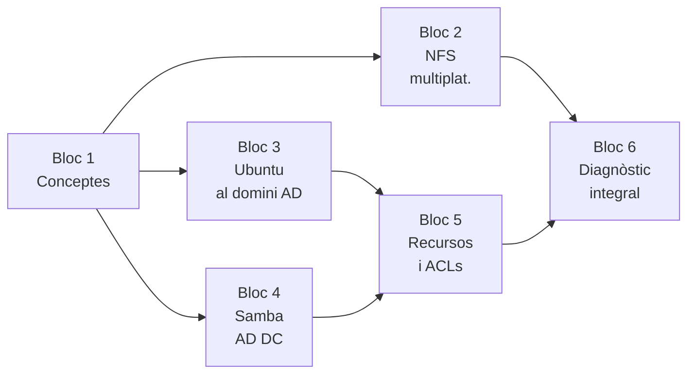

# :material-lan-connect: UT4 · Integració de sistemes heterogenis

!!! abstract "Presentació de la unitat"
    En aquesta unitat integrem entorns **Windows i Linux** en un únic directori d'usuaris. Treballem **NFS multiplataforma**, la integració d'**Ubuntu al domini Active Directory** (realmd + SSSD + Kerberos) i **Samba com a controlador de domini AD-compatible**. Apliquem recursos compartits, ACLs esteses i diagnòstic integral.

## Blocs de la unitat

| Bloc | Títol | Projecte | Contingut principal |
|------|-------|---------|---------------------|
| **Bloc 1** | [Conceptes d'integració](bloc1-conceptes/00-anatomia-infraestructura-heterogenia.md) | P41–P45 | Anatomia infraestructura, protocols (LDAP, Kerberos, SMB, NFS), comparativa |
| **Bloc 2** | [NFS multiplataforma](bloc2-nfs-windows/01-nfs-windows-server-2022.md) | P44 | WS2022 servidor NFS, Ubuntu servidor NFS, Client for NFS Windows |
| **Bloc 3** | [Ubuntu al domini AD](bloc3-linux-ad/01-ubuntu-ad-realmd.md) | P41 | realmd, sssd.conf, Kerberos, oddjob-mkhomedir |
| **Bloc 4** | [Samba com a AD DC](bloc4-samba-ad-dc/01-samba-ad-dc-arquitectura.md) | P42 | `samba-tool domain provision`, clients Windows i Linux al Samba-AD |
| **Bloc 5** | [Recursos i ACLs](bloc5-recursos-acls/01-recursos-acls-domini.md) | P42 | Recursos compartits al domini, `setfacl`/`getfacl`, `acl_xattr` |
| **Bloc 6** | [Diagnòstic integral](bloc6-diagnostic/01-diagnostic-integral-ut4.md) | P41–P45 | Flowchart diagnòstic, ordres clau, taula d'errors freqüents |

## Mapa de la unitat

---

## SpeedRun · Projectes interactius

Aplica els continguts de la UT4 amb projectes pràctics al quadern digital. Cada projecte té activitats guiades, autodesat automàtic i exportació en PDF.

- :material-microsoft-windows:{ .lg }

    ### Projecte 41 · Ubuntu → WS2022 AD

    Uneix un client Ubuntu a un domini Windows Server 2022 Active Directory amb realmd, SSSD i Kerberos.

    :material-clock-outline: 10–12 h &nbsp;·&nbsp; Blocs 1, 3 &nbsp;·&nbsp; RA4, RA5, RA6

    [:octicons-arrow-right-24: Veure el projecte](speedrun/projecte41.md){ .md-button .md-button--primary }

- :material-domain:{ .lg }

    ### Projecte 42 · Samba com a AD DC

    Desplega Samba-AD DC (libretic.local), uneix clients Windows i Ubuntu, comparteix recursos amb ACLs.

    :material-clock-outline: 12–14 h &nbsp;·&nbsp; Blocs 1, 4–5 &nbsp;·&nbsp; RA4, RA5, RA6

    [:octicons-arrow-right-24: Veure el projecte](speedrun/projecte42.md){ .md-button .md-button--primary }

- :material-folder-network:{ .lg }

    ### Projecte 44 · NFS multiplataforma

    Configura NFS bidireccional: WS2022 com a servidor NFS i Ubuntu com a servidor NFS per a clients Windows.

    :material-clock-outline: 8–10 h &nbsp;·&nbsp; Bloc 2 &nbsp;·&nbsp; RA4, RA5

    [:octicons-arrow-right-24: Veure el projecte](speedrun/projecte44.md){ .md-button .md-button--primary }

- :material-help-box:{ .lg }

    ### Projecte 45 · Dossier de preguntes

    Consolida i avalua els coneixements teòrics de tota la unitat per blocs.

    :material-clock-outline: 3–4 h &nbsp;·&nbsp; UT4 completa &nbsp;·&nbsp; RA4, RA5, RA6

    [:octicons-arrow-right-24: Veure el projecte](speedrun/projecte45.md){ .md-button .md-button--primary }

---

## Relació amb UT1, UT2 i UT3

| UT1 (Windows Server) | UT2 (Linux Server) | UT3 (Compartició) | UT4 (Integració) |
|---------------------|-------------------|--------------------|-----------------|
| AD DS bàsic | OpenLDAP bàsic | Samba + LDAP | Samba-AD DC |
| GPO bàsiques | SSSD per LDAP | — | SSSD per AD |
| Carpetes NTFS | NFS bàsic | NFS avançat | NFS multiplataforma |
| Clients W11 al domini | Clients Ubuntu LDAP | — | Clients multiplataforma |
| — | — | — | ACLs POSIX + acl_xattr |
