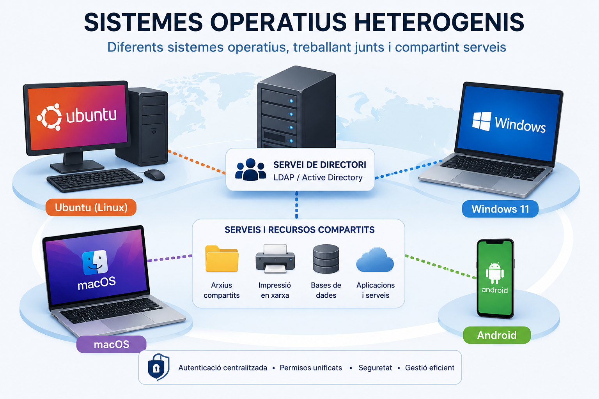
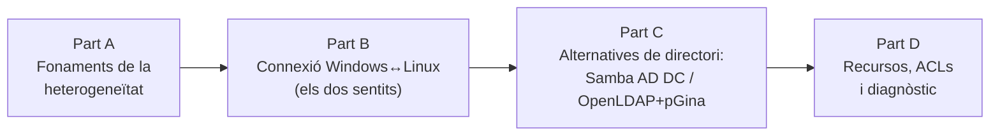
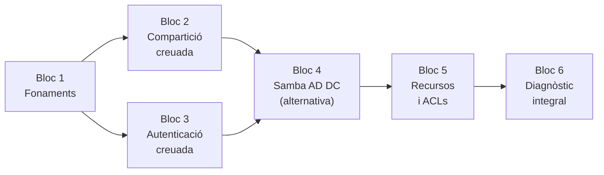

# :material-lan-connect: UT4 · Integració de sistemes heterogenis

!!! abstract "Presentació de la unitat"
    L'eix d'aquesta unitat és **entendre els sistemes operatius heterogenis** a través de la **connexió entre Windows i Linux en tots dos sentits** i, sobretot, les **particularitats i dificultats** que hi apareixen: mapatge d'identitats (UID/GID ↔ SID), traducció de permisos (NTFS ↔ POSIX ↔ ACLs), autenticació creuada (Kerberos, SSSD) i interoperabilitat de protocols (SMB ↔ NFS). Un cop entesa la integració, s'exploren dues **alternatives** de directori centralitzat compatibles amb clients Windows i Linux: **Samba com a AD DC** i **OpenLDAP amb integració Windows via pGina**.

## Enfocament: primer la connexió, després les alternatives

```mermaid
graph LR
    A["Part A\nFonaments de la\nheterogeneïtat"] --> B["Part B\nConnexió Windows↔Linux\n(els dos sentits)"]
    B --> C["Part C\nAlternatives de directori:\nSamba AD DC / OpenLDAP+pGina"]
    C --> D["Part D\nRecursos, ACLs\ni diagnòstic"]
```

L'objectiu pedagògic **no** és muntar un producte concret, sinó entendre *per què* la convivència de mons és difícil i *com* es resol. La Part A i la Part B són el nucli, treballades als Blocs 1–3; Samba AD DC (Blocs 4–5) i el projecte d'OpenLDAP+pGina (sense bloc dedicat, ampliació de la UT2) en són extensions alternatives.

## Blocs de la unitat

| Bloc | Títol | Contingut principal |
|------|-------|---------------------|
| **Bloc 1** | [Fonaments de la heterogeneïtat](bloc1-fonaments/00-anatomia-infraestructura-heterogenia.md) | Anatomia, protocols (LDAP, Kerberos, SMB, NFS), comparativa, **particularitats i dificultats** |
| **Bloc 2** | [Compartició creuada](bloc2-comparticio-creuada/01-nfs-windows-server-2022.md) | NFS multiplataforma, **client SMB des de Linux**, **mapatge d'identitats i permisos** |
| **Bloc 3** | [Autenticació creuada](bloc3-autenticacio-creuada/01-ubuntu-ad-realmd.md) | Ubuntu al domini AD: realmd, sssd.conf, Kerberos, oddjob-mkhomedir |
| **Bloc 4** | [Samba com a AD DC *(alternativa)*](bloc4-samba-ad-dc/01-samba-ad-dc-arquitectura.md) | Provisió, domini, usuaris/grups, perfils mòbils, RSAT, comparativa d'estratègies |
| **Bloc 5** | [Recursos i ACLs](bloc5-recursos-acls/01-recursos-acls-domini.md) | Recursos compartits al domini, `setfacl`/`getfacl`, `acl_xattr` |
| **Bloc 6** | [Diagnòstic integral](bloc6-diagnostic/01-diagnostic-integral-ut4.md) | Verificació de punta a punta de l'entorn heterogeni |

## Mapa de la unitat

```mermaid
graph LR
    B1["Bloc 1\nFonaments"] --> B2["Bloc 2\nCompartició\ncreuada"]
    B1 --> B3["Bloc 3\nAutenticació\ncreuada"]
    B2 --> B4["Bloc 4\nSamba AD DC\n(alternativa)"]
    B3 --> B4
    B4 --> B5["Bloc 5\nRecursos\ni ACLs"]
    B5 --> B6["Bloc 6\nDiagnòstic\nintegral"]
    click B1 "bloc1-fonaments/00-anatomia-infraestructura-heterogenia/" "Obrir Bloc 1"
    click B2 "bloc2-comparticio-creuada/01-nfs-windows-server-2022/" "Obrir Bloc 2"
    click B3 "bloc3-autenticacio-creuada/01-ubuntu-ad-realmd/" "Obrir Bloc 3"
    click B4 "bloc4-samba-ad-dc/01-samba-ad-dc-arquitectura/" "Obrir Bloc 4"
    click B5 "bloc5-recursos-acls/01-recursos-acls-domini/" "Obrir Bloc 5"
    click B6 "bloc6-diagnostic/01-diagnostic-integral-ut4/" "Obrir Bloc 6"
```

---

## SpeedRun · Projectes interactius

Aplica els continguts de la UT4 amb projectes pràctics al quadern digital. Cada projecte té activitats guiades, autodesat automàtic i exportació en PDF.

- :material-microsoft-windows:{ .lg }

    ### Projecte 41 · Ubuntu → WS2022 AD

    Uneix un client Ubuntu a un domini Windows Server 2022 Active Directory amb realmd, SSSD i Kerberos.

    :material-clock-outline: 10–12 h &nbsp;·&nbsp; Blocs 1, 3 &nbsp;·&nbsp; RA4, RA5, RA6

    [:octicons-arrow-right-24: Veure el projecte](speedrun/projecte41.md){ .md-button .md-button--primary }

- :material-account-network:{ .lg }

    ### Projecte 42 · OpenLDAP multiplataforma

    Desplega OpenLDAP amb TLS, perfils mòbils NFSv4, recursos Samba per LDAP i un client Windows 11 integrat via pGina.

    :material-clock-outline: 12–14 h &nbsp;·&nbsp; Projecte complementari &nbsp;·&nbsp; RA4, RA5, RA6

    [:octicons-arrow-right-24: Veure el projecte](speedrun/projecte42.md){ .md-button .md-button--primary }

- :material-domain:{ .lg }

    ### Projecte 43 · Samba com a AD DC

    Desplega Samba-AD DC (libretic.local), uneix clients Windows i Ubuntu, comparteix recursos amb ACLs.

    :material-clock-outline: 12–14 h &nbsp;·&nbsp; Blocs 1, 4–5 &nbsp;·&nbsp; RA4, RA5, RA6

    [:octicons-arrow-right-24: Veure el projecte](speedrun/projecte43.md){ .md-button .md-button--primary }

---

## Relació amb UT1, UT2 i UT3

| UT1 (Windows Server) | UT2 (Linux Server) | UT3 (Compartició) | UT4 (Integració) |
|---------------------|-------------------|--------------------|-----------------|
| AD DS bàsic | OpenLDAP bàsic | Samba + LDAP | Samba-AD DC · OpenLDAP + Windows (pGina) |
| GPO bàsiques | SSSD per LDAP | — | SSSD per AD |
| Carpetes NTFS | NFS bàsic | NFS avançat | NFS multiplataforma + client SMB |
| Clients W11 al domini | Clients Ubuntu LDAP | — | Clients multiplataforma |
| — | — | — | Mapatge d'identitats + ACLs POSIX |
