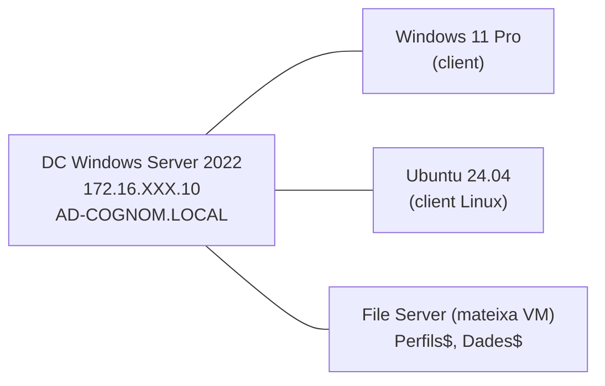

# :material-lightning-bolt: SpeedRun P41 · Windows Server 2022 Active Directory

!!! abstract "Quadern del projecte"
    Fitxa-guia ràpida per al **Projecte P41**: instal·lació i configuració d'un domini Active Directory amb Windows Server 2022, unió de clients Windows i Linux, GPOs i recursos compartits.

---

## Topologia del lab P41



---

## Fases del projecte

=== "Fase 1 · AD-DS i DNS"

    **Objectiu**: Instal·lar AD DS i crear el domini

    ```powershell
    # Configura IP estàtica (GUI o PowerShell)
    New-NetIPAddress -InterfaceAlias "Ethernet" -IPAddress "172.16.XXX.10" `
        -PrefixLength 24 -DefaultGateway "172.16.XXX.1"

    # Instal·la AD DS
    Install-WindowsFeature AD-Domain-Services -IncludeManagementTools

    # Promou el DC
    Install-ADDSForest -DomainName "ad-cognom.local" `
        -DomainNetbiosName "AD-COGNOM" `
        -SafeModeAdministratorPassword (ConvertTo-SecureString "P@ssw0rd1234" -AsPlainText -Force) `
        -InstallDns -Force
    ```

    **Verifica**: `dcdiag /test:dns` · `Get-ADDomain` · `nslookup ad-cognom.local`

=== "Fase 2 · OUs, Usuaris i Grups"

    **Objectiu**: Estructura organitzativa del P41

    ```powershell
    # OUs principals
    New-ADOrganizationalUnit -Name "Usuaris-UT4" -Path "DC=ad-cognom,DC=local"
    New-ADOrganizationalUnit -Name "Equips-UT4" -Path "DC=ad-cognom,DC=local"

    # Usuaris del projecte
    New-ADUser -Name "director201" -SamAccountName "director201" `
        -UserPrincipalName "director201@ad-cognom.local" `
        -Path "OU=Usuaris-UT4,DC=ad-cognom,DC=local" `
        -AccountPassword (ConvertTo-SecureString "Abc1234!" -AsPlainText -Force) -Enabled $true
    New-ADUser -Name "extern202" -SamAccountName "extern202" `
        -UserPrincipalName "extern202@ad-cognom.local" `
        -Path "OU=Usuaris-UT4,DC=ad-cognom,DC=local" `
        -AccountPassword (ConvertTo-SecureString "Abc1234!" -AsPlainText -Force) -Enabled $true
    New-ADUser -Name "tecnic203" -SamAccountName "tecnic203" `
        -UserPrincipalName "tecnic203@ad-cognom.local" `
        -Path "OU=Usuaris-UT4,DC=ad-cognom,DC=local" `
        -AccountPassword (ConvertTo-SecureString "Abc1234!" -AsPlainText -Force) -Enabled $true

    # Grup
    New-ADGroup -Name "tecnics" -GroupScope Global -GroupCategory Security `
        -Path "OU=Usuaris-UT4,DC=ad-cognom,DC=local"
    Add-ADGroupMember -Identity "tecnics" -Members "tecnic203"
    ```

=== "Fase 3 · Clients i GPOs"

    **Windows 11**: `Add-Computer -DomainName "ad-cognom.local" -Restart`

    **Ubuntu 24.04**:
    ```bash
    sudo realm join ad-cognom.local -U administrator
    # Ajusta sssd.conf: use_fully_qualified_names=False
    sudo pam-auth-update --enable mkhomedir
    ```

    **GPO restriccions**:
    ```powershell
    $gpo = New-GPO -Name "Restriccions-UT4"
    New-GPLink -Name "Restriccions-UT4" -Target "OU=Usuaris-UT4,DC=ad-cognom,DC=local"
    # Panell control blocat:
    Set-GPRegistryValue -Name "Restriccions-UT4" `
        -Key "HKCU\Software\Microsoft\Windows\CurrentVersion\Policies\Explorer" `
        -ValueName "NoControlPanel" -Type DWord -Value 1
    gpupdate /force
    ```

=== "Fase 4 · Recursos i Backup"

    **Carpeta compartida i perfils mòbils**:
    ```powershell
    New-SmbShare -Name "Perfils$" -Path "C:\Perfils" -FullAccess "Domain Users"
    Set-ADUser director201 -ProfilePath "\\DC-cognom\Perfils$\director201"
    ```

    **Backup amb Robocopy**:
    ```powershell
    robocopy "C:\Dades" "D:\Backup\Dades" /MIR /R:3 /W:10 /LOG:C:\backup.log
    ```

---

## Checklist P41

| # | Tasca | Verificació |
|---|-------|------------|
| 1 | IP estàtica al DC | `ipconfig` mostra `172.16.XXX.10` |
| 2 | AD DS instal·lat i promogut | `dcdiag /test:dns` OK |
| 3 | DNS SRV records | `nslookup -type=SRV _ldap._tcp.ad-cognom.local` |
| 4 | OUs creades | `Get-ADOrganizationalUnit -Filter *` |
| 5 | Usuaris i grups | `Get-ADUser -Filter *` / `Get-ADGroupMember tecnics` |
| 6 | Windows 11 al domini | `whoami` = `AD-COGNOM\director201` |
| 7 | Ubuntu al domini | `realm list` / `id director201` |
| 8 | GPO aplicada | `gpresult /r` mostra "Restriccions-UT4" |
| 9 | Perfils mòbils | Login W11 → crea `\\DC\Perfils$\usuari.V6` |
| 10 | Backup Robocopy | Log sense errors |

---

!!! info "Quadern del projecte"
    El quadern oficial amb les activitats detallades, captures de pantalla i rúbriques d'avaluació el trobaràs a: [#](#)

!!! tip "Ordre recomanat"
    Segueix les fases en ordre. No uneixis els clients al domini (Fase 3) fins que no haigis verificat `dcdiag /test:dns` (Fase 1). Un DNS mal configurat fa fallar totes les capes superiors.
