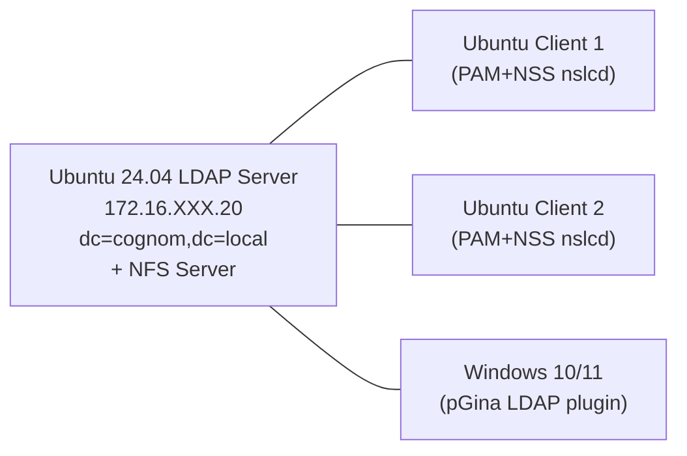

# :material-lightning-bolt: SpeedRun P42 · OpenLDAP multiplataforma

!!! abstract "Quadern del projecte"
    Fitxa-guia ràpida per al **Projecte P42**: servidor OpenLDAP, clients Ubuntu i Windows (pGina), perfils mòbils via NFS+autofs, i recursos compartits Samba.

---

## Topologia del lab P42



---

## Fases del projecte

=== "Fase 1 · Servidor OpenLDAP"

    **Objectiu**: instal·lar slapd i crear l'estructura DIT

    ```bash
    sudo apt install slapd ldap-utils
    sudo dpkg-reconfigure slapd
    # DNS domain: cognom.local
    # Organization: cognom
    # Admin password: (tria un)
    # Backend: MDB

    # Crea les OUs principals
    cat << 'EOF' > ous.ldif
    dn: ou=usuaris,dc=cognom,dc=local
    objectClass: organizationalUnit
    ou: usuaris

    dn: ou=grups,dc=cognom,dc=local
    objectClass: organizationalUnit
    ou: grups
    EOF
    ldapadd -x -D "cn=admin,dc=cognom,dc=local" -W -f ous.ldif
    ```

    **Crea usuaris** (POSIX: uidNumber, gidNumber, homeDirectory, loginShell):
    ```bash
    # director201: uidNumber=10001, homeDirectory=/home/201/director201
    # extern202:   uidNumber=10002, homeDirectory=/home/201/extern202
    # tecnic203:   uidNumber=10003, homeDirectory=/home/201/tecnic203
    ldapadd -x -D "cn=admin,dc=cognom,dc=local" -W -f usuaris.ldif
    ```

    **Verifica**: `ldapsearch -x -b "dc=cognom,dc=local" "(uid=director201)"`

=== "Fase 2 · Client Ubuntu (PAM+NSS)"

    ```bash
    sudo apt install libnss-ldapd libpam-ldapd ldap-utils nslcd
    # Server: ldap://172.16.XXX.20
    # Base DN: dc=cognom,dc=local
    # Serveis NSS: passwd, group, shadow

    # nsswitch.conf: passwd/group/shadow → files systemd ldap

    getent passwd director201   # Ha de funcionar
    id director201
    su - director201
    ```

=== "Fase 3 · Perfils mòbils NFS"

    **Al servidor NFS (172.16.XXX.20)**:
    ```bash
    sudo mkdir -p /srv/nfs/homes/201/{director201,extern202,tecnic203}
    sudo chown 10001:10001 /srv/nfs/homes/201/director201
    # /etc/exports:
    # /srv/nfs/homes/201 *(rw,sync,no_root_squash)
    sudo exportfs -ra
    sudo systemctl enable --now nfs-kernel-server
    ```

    **LDAP**: actualitza homeDirectory a `/home/201/director201`

    **Al client (autofs)**:
    ```bash
    sudo apt install autofs
    # /etc/auto.master: /home/201  /etc/auto.homes  --timeout=60
    # /etc/auto.homes:  *  172.16.XXX.20:/srv/nfs/homes/201/&
    sudo systemctl restart autofs
    su - director201  # Home muntat automàticament
    ```

=== "Fase 4 · pGina (Windows LDAP)"

    ```
    pGina: LDAP Authentication Plugin
    LDAP Host: 172.16.XXX.20
    Port: 389
    Search DN: cn=admin,dc=cognom,dc=local
    Search Filter: uid=%u
    DN Pattern: uid=%u,ou=usuaris,dc=cognom,dc=local
    ```

    **Test**: botó "Simulate" amb usuari `director201` i contrasenya → Success

    **Login Windows**: inicia sessió amb `director201` / (contrasenya LDAP)
    → `whoami` mostra `NOM-EQUIP\director201` (compte local temporal de pGina)

---

## Checklist P42

| # | Tasca | Verificació |
|---|-------|------------|
| 1 | slapd instal·lat i configurat | `ldapsearch -x -b "dc=cognom,dc=local"` |
| 2 | OUs creades | `ldapsearch -x "(ou=*)"` |
| 3 | Usuaris POSIX creats | uidNumber, gidNumber, homeDirectory, loginShell |
| 4 | Client Ubuntu nslcd | `getent passwd director201` |
| 5 | Login SSH Ubuntu | `ssh director201@client` funciona |
| 6 | NFS servidor exporta | `showmount -e 172.16.XXX.20` |
| 7 | autofs munta homes | `su - director201` → `df -h` mostra NFS mount |
| 8 | pGina configurat i test OK | Simulate → Success |
| 9 | Login Windows pGina | `whoami` = `NOM-EQUIP\director201` |

---

!!! info "Quadern del projecte"
    El quadern oficial amb les activitats detallades, captures de pantalla i rúbriques d'avaluació el trobaràs a: [#](#)

!!! warning "Consistència UID/GID"
    Tots els clients NFS han de tenir el **mateix UID/GID** per a cada usuari. Si el client i el servidor NFS discrepitzen els UIDs, els fitxers apareixeran com a propietat d'un UID numèric desconegut. L'avantatge de LDAP és que és la font d'autoritat per als UIDs de tots els clients.
