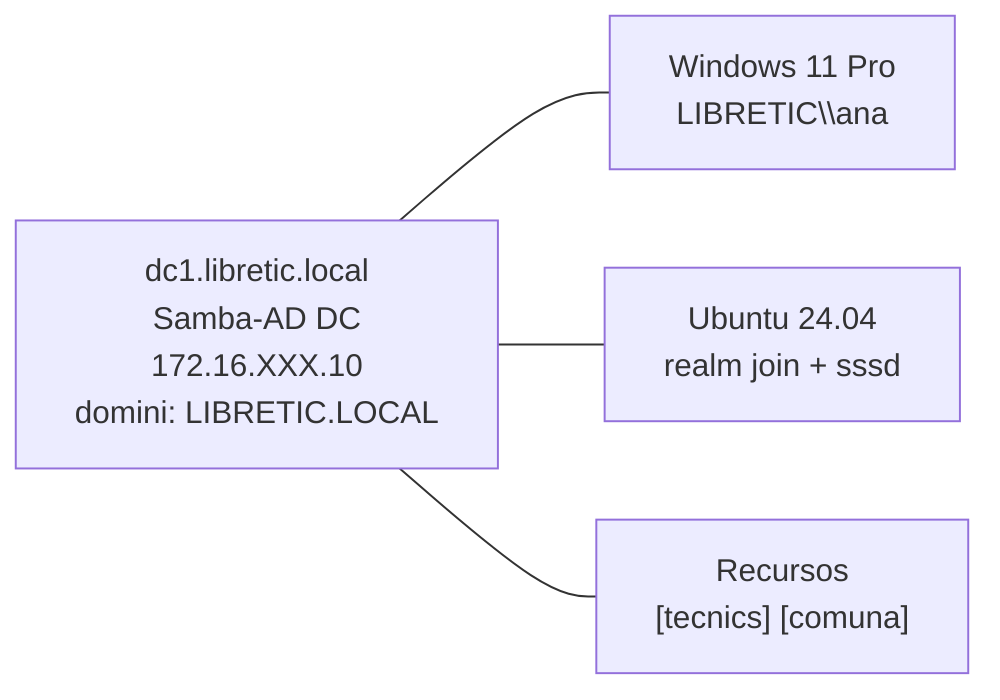

# :material-lightning-bolt: SpeedRun P43 · Samba-AD DC (libretic.local)

!!! abstract "Quadern del projecte"
    Fitxa-guia ràpida per al **Projecte P43**: desplegament de Samba com a Active Directory DC (`libretic.local`), clients Windows i Linux, recursos compartits amb ACLs.

---

## Topologia del lab P43



---

## Fases del projecte

=== "Fase 1 · Provision Samba-AD DC"

    **Objectiu**: desplegar Samba com a AD DC

    ```bash
    sudo apt install samba samba-dsdb-modules

    # Desactiva smbd/nmbd (conflicte amb samba-ad-dc)
    sudo systemctl disable --now smbd nmbd winbind

    # Backup smb.conf i neteja
    sudo mv /etc/samba/smb.conf /etc/samba/smb.conf.bak

    # Configura hostname
    sudo hostnamectl set-hostname dc1.libretic.local

    # Provision del domini
    sudo samba-tool domain provision \
        --realm=LIBRETIC.LOCAL \
        --domain=LIBRETIC \
        --server-role=dc \
        --dns-backend=SAMBA_INTERNAL \
        --adminpass='Admin1234!' \
        --use-rfc2307

    # Copia krb5.conf
    sudo cp /var/lib/samba/private/krb5.conf /etc/krb5.conf

    # Activa el servei
    sudo systemctl enable --now samba-ad-dc
    ```

    **Verifica**:
    ```bash
    sudo wbinfo -u                    # Llista usuaris (Administrator, Guest...)
    host -t SRV _ldap._tcp.libretic.local 127.0.0.1
    kinit administrator@LIBRETIC.LOCAL
    klist
    ```

=== "Fase 2 · Usuaris i Grups"

    ```bash
    # Crea usuaris RFC2307 (amb UID/GID POSIX)
    sudo samba-tool user create ana --uid-number=10001 --gid-number=10001
    sudo samba-tool user create marc --uid-number=10002 --gid-number=10001
    sudo samba-tool user create clara --uid-number=10003 --gid-number=10002

    # Crea grups
    sudo samba-tool group add tecnics
    sudo samba-tool group add comptabilitat
    sudo samba-tool group add direccio

    # Assigna membres
    sudo samba-tool group addmembers tecnics ana,marc
    sudo samba-tool group addmembers comptabilitat clara
    sudo samba-tool group addmembers direccio ana

    # Verifica
    sudo samba-tool user list
    sudo samba-tool group listmembers tecnics
    ```

=== "Fase 3 · Clients Windows"

    ```powershell
    # DNS → 172.16.XXX.10 (DC Samba)
    Set-DnsClientServerAddress -InterfaceAlias "Ethernet" -ServerAddresses "172.16.XXX.10"
    nslookup libretic.local

    # Domain join
    Add-Computer -DomainName "libretic.local" -Restart

    # Post-login com LIBRETIC\ana:
    whoami         # LIBRETIC\ana
    whoami /groups # Mostra tecnics, Domain Users...
    ```

=== "Fase 4 · Clients Linux"

    ```bash
    sudo apt install realmd sssd sssd-tools adcli krb5-user oddjob oddjob-mkhomedir
    # DNS apunta a 172.16.XXX.10

    realm discover libretic.local
    sudo realm join libretic.local -U Administrator

    # Ajusta sssd.conf:
    # use_fully_qualified_names = False
    # fallback_homedir = /home/%u
    sudo systemctl restart sssd
    sudo pam-auth-update --enable mkhomedir
    sudo systemctl enable --now oddjobd

    id ana          # uid=10001(ana) ...
    su - ana        # Login OK
    ```

=== "Fase 5 · Recursos i ACLs"

    ```bash
    # Crea directoris
    sudo mkdir -p /srv/samba/{tecnics,comuna}
    sudo chmod 770 /srv/samba/tecnics
    sudo chmod 777 /srv/samba/comuna

    # smb.conf (afegeix al final):
    # [tecnics]
    #   path = /srv/samba/tecnics
    #   valid users = @tecnics
    #   writable = yes
    #   vfs objects = acl_xattr
    #   map acl inherit = yes
    # [comuna]
    #   path = /srv/samba/comuna
    #   writable = yes

    sudo systemctl restart samba-ad-dc

    # Verifica des del client Linux:
    smbclient //dc1.libretic.local/tecnics -U ana    # OK
    smbclient //dc1.libretic.local/tecnics -U clara  # NT_STATUS_ACCESS_DENIED

    # ACLs POSIX al servidor:
    setfacl -m g:tecnics:rwx /srv/samba/tecnics/
    setfacl -d -m g:tecnics:rwx /srv/samba/tecnics/
    ```

---

## Checklist P43

| # | Tasca | Verificació |
|---|-------|------------|
| 1 | Samba provision completat | `wbinfo -u` / `samba-tool user list` |
| 2 | DNS intern SRV records | `host -t SRV _ldap._tcp.libretic.local 127.0.0.1` |
| 3 | Kerberos funciona | `kinit administrator@LIBRETIC.LOCAL` + `klist` |
| 4 | Usuaris ana/marc/clara | `samba-tool user list` |
| 5 | Grups tecnics/comptabilitat | `samba-tool group listmembers tecnics` |
| 6 | Windows domain join | `whoami` = `LIBRETIC\ana` |
| 7 | Ubuntu realm join | `realm list` / `id ana` |
| 8 | Recurs [tecnics] limitat | `smbclient -U clara` → ACCESS_DENIED |
| 9 | Recurs [comuna] obert | `smbclient -U clara` → OK |
| 10 | ACLs POSIX amb herència | `getfacl /srv/samba/tecnics/` té `default:group:tecnics:rwx` |

---

!!! info "Quadern del projecte"
    El quadern oficial amb les activitats detallades, captures de pantalla i rúbriques d'avaluació el trobaràs a: [#](#)

!!! warning "smbd/nmbd: han d'estar DESACTIVATS"
    El servei `samba-ad-dc` és incompatible amb `smbd` i `nmbd` si tots dos estan actius. Comprova sempre: `sudo systemctl status smbd nmbd` → han d'estar `inactive (dead)`. Si `smbd` interfere, `samba-ad-dc` fallarà a l'inici.
