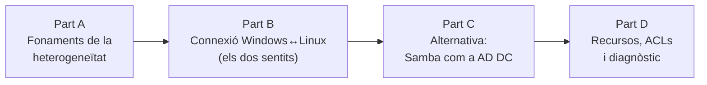

# :material-lan-connect: UT5 · Integració de sistemes heterogenis (versió millorada)

!!! warning "Unitat en proves — no publicada"
    Aquesta UT5 és una **reelaboració de la UT4** amb un enfocament nou. Es manté **oculta** (`exclude_docs`) mentre es decideix si substitueix la UT4 o s'hi fusiona. No enllaçar-la des del web fins que estigui validada.

!!! abstract "Presentació de la unitat"
    L'eix d'aquesta unitat és **entendre els sistemes operatius heterogenis** a través de la **connexió entre Windows i Linux en tots dos sentits** i, sobretot, les **particularitats i dificultats** que hi apareixen: mapatge d'identitats (UID/GID ↔ SID), traducció de permisos (NTFS ↔ POSIX ↔ ACLs), autenticació creuada (Kerberos, SSSD) i interoperabilitat de protocols (SMB ↔ NFS). Un cop entesa la integració, s'introdueix **Samba com a AD DC** com a *alternativa*: muntar el nostre propi controlador de domini compatible.

## Enfocament: primer la connexió, després l'alternativa

L'objectiu pedagògic **no** és muntar un producte concret, sinó que l'alumne entengui *per què* la convivència de mons és difícil i *com* es resol. La Part A i la Part B són el nucli; Samba AD DC és extensió.

## Estructura de la unitat

| Part | Bloc | Contingut | Estat |
|------|------|-----------|-------|
| **A** | Bloc 1 · Fonaments de la heterogeneïtat | Anatomia, sistemes heterogenis, comparativa AD/LDAP/Samba, **particularitats i dificultats** | 🚧 |
| **B** | Bloc 2 · Compartició creuada | NFS multiplataforma, **client SMB des de Linux**, **mapatge d'identitats i permisos** | 🚧 |
| **B** | Bloc 3 · Autenticació creuada | Ubuntu al domini AD (realmd, SSSD, Kerberos, oddjob) | 🚧 |
| **C** | Bloc 4 · Samba com a AD DC *(alternativa)* | Provisió, domini, usuaris, perfils mòbils, RSAT, comparativa d'estratègies | 🚧 |
| **D** | Bloc 5 · Recursos i ACLs | Recursos compartits i ACLs POSIX al domini | 🚧 |
| **D** | Bloc 6 · Diagnòstic integral | Verificació de punta a punta de l'entorn heterogeni | 🚧 |

!!! info "Entorn de laboratori (coherent amb UT1–UT4)"
    - Domini: `lafita.local` · DC segons escenari (Windows Server 2022 o Samba AD DC sobre Ubuntu 24.04)
    - Usuaris d'exemple: `maria.puig`, `pere.costa`, `anna.valls`
    - Xarxa interna: `192.168.100.0/24` · Servidor: `192.168.100.10` · Client: `192.168.100.20`

## Novetats respecte a la UT4

- **[NOU] Particularitats i dificultats de la integració** — capítol conceptual que és l'eix de la unitat.
- **[NOU] Accés a comparticions Windows des de Linux** (`smbclient`, `mount -t cifs`) — tanca el cercle bidireccional.
- **[NOU] Mapatge d'identitats i permisos** aplicat a la compartició creuada.
- **[MILLORA] Samba AD DC ampliat** — provisió detallada, configuració del domini, usuaris/grups, perfils mòbils, administració RSAT i comparativa d'estratègies.
- **Sense Zentyal** (descartat per producte de nínxol).
